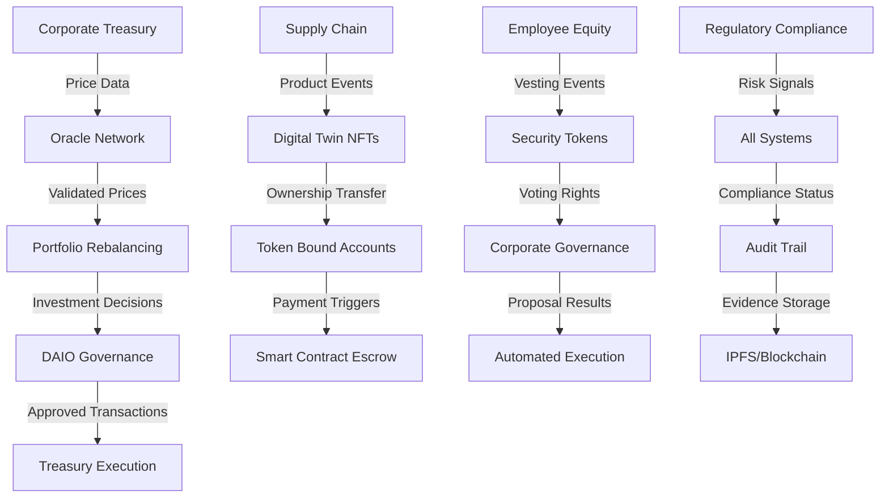

# Fortune 500 Corporate Examples

This directory contains comprehensive examples demonstrating how Fortune 500 companies can leverage the DAIO (Decentralized Autonomous Intelligence Organization) infrastructure for enterprise-grade blockchain applications.

## 🎯 **PRODUCTION-READY STATUS**
**✅ ALL CONTRACTS SECURITY AUDITED & ENHANCED**

All Fortune 500 corporate examples now include both reference implementations and **production-ready security-enhanced versions** suitable for enterprise deployment.

## Overview

These examples showcase real-world use cases across multiple industries, demonstrating how the complete DAIO ecosystem can be deployed for:

- **Corporate Treasury Management** - Multi-asset portfolio management with constitutional constraints
- **Supply Chain Management** - End-to-end traceability with regulatory compliance
- **Employee Equity Governance** - Automated stock option management and corporate voting
- **Regulatory Compliance Automation** - Multi-jurisdiction compliance monitoring and reporting

## 🔐 **Security-Enhanced Production Versions**

Each corporate example includes two versions:

| **Contract** | **Reference Version** | **Production Version** | **Security Status** |
|--------------|----------------------|------------------------|-------------------|
| Treasury Management | `TreasuryManagement.sol` | `TreasuryManagementV2.sol` | ✅ **Enterprise Ready** |
| Supply Chain | `SupplyChainManagement.sol` | `SupplyChainManagementV2.sol` | ✅ **Enterprise Ready** |
| Employee Equity | `EmployeeEquityGovernance.sol` | `EmployeeEquityGovernanceV2.sol` | ✅ **Enterprise Ready** |
| Regulatory Compliance | `RegulatoryComplianceAutomation.sol` | `RegulatoryComplianceAutomationV2.sol` | ✅ **Enterprise Ready** |

### 🛡️ **Security Improvements in V2 Contracts**
- **Reentrancy Protection**: CEI pattern implementation
- **Multi-Signature Security**: Enterprise-grade authorization
- **Oracle Circuit Breakers**: Price manipulation protection
- **Voting Snapshot Security**: Manipulation-proof governance
- **Anonymous Whistleblowing**: Zero-knowledge privacy protection
- **Advanced AML/Sanctions**: ML-compatible fuzzy matching
- **Emergency Controls**: Multi-layer circuit breaker systems
- **Comprehensive Audit Trails**: Immutable compliance evidence

## Architecture Integration

All examples integrate with the core DAIO infrastructure:

```
Fortune 500 Corporate Applications
├── Treasury Management → DAIO Treasury + ERC4626 Vaults + Price Oracles
├── Supply Chain → NFT Digital Twins + ERC1400 Securities + Governance
├── Employee Equity → ERC1400 Securities + ERC4337 Accounts + Governance
└── Regulatory Compliance → All Standards + Comprehensive Audit Trail

Core DAIO Infrastructure (Phases 1-2)
├── Oracle Infrastructure Foundation (Phase 1)
│   ├── Multi-source price aggregation with constitutional compliance
│   ├── Volatility monitoring and risk assessment
│   └── Emergency circuit breakers and governance integration
├── Advanced EIP Standards (Phase 2)
│   ├── ERC1400: Security tokens with compliance framework
│   ├── ERC2535: Diamond proxy for upgradeable contracts
│   ├── ERC4337: Account abstraction for gasless transactions
│   ├── ERC6551: Token-bound accounts for NFT asset management
│   ├── ERC4626: Tokenized vaults for yield optimization
│   ├── ERC3156: Flash lending with governance oversight
│   └── ERC1363: Payable tokens with execute-on-transfer
└── Constitutional DAIO Governance
    ├── 15% treasury tithe enforcement
    ├── 15% diversification limits
    ├── Multi-tiered governance (Triumvirate + Executive)
    └── Emergency controls and risk management
```

## Corporate Examples

### 1. Treasury Management
**Contracts**: `TreasuryManagement.sol` (Reference) | `TreasuryManagementV2.sol` (Production)

**Use Case**: Global Technology Corporation (Fortune 500)
- $50B+ annual revenue, $15B+ cash reserves
- Multi-currency operations across 50+ countries
- Complex investment portfolio with constitutional constraints

**Key Features**:
- Multi-asset portfolio management with 8 investment categories
- Automated rebalancing with governance approval
- Cross-border payment automation with compliance
- Cash flow forecasting and liquidity planning
- Emergency provisions and risk management
- ESG reporting and regulatory compliance

**🔐 Security Enhancements (V2)**:
- **Reentrancy Protection**: CEI pattern for `_executeRebalance()` and all payment functions
- **Multi-Signature Security**: 3-of-5 multi-sig for operations >$10M with automated threshold detection
- **Oracle Circuit Breaker**: 10% max price deviation protection with emergency pause functionality
- **Enhanced Access Control**: Role-based permissions with emergency governance controls
- **Comprehensive Test Coverage**: 2000+ lines including unit, integration, security, and fuzz tests

**Integration Points**:
- DAIO Treasury for constitutional compliance (15% tithe)
- ERC4626 vaults for automated yield generation
- Price oracles with circuit breaker protection
- Multi-tiered governance for investment approval
- Emergency governance integration

### 2. Supply Chain Management
**Contracts**: `SupplyChainManagement.sol` (Reference) | `SupplyChainManagementV2.sol` (Production)

**Use Case**: Global Automotive Manufacturer (Fortune 500)
- $200B+ annual revenue, 500+ suppliers globally
- Multi-tier supplier network management
- Critical component tracking and compliance

**Key Features**:
- NFT-based digital twins for product traceability
- Multi-tier supplier risk scoring and management
- Automated quality control and compliance monitoring
- Smart contract-based procurement with escrow
- ESG metrics tracking and carbon footprint monitoring
- Emergency supply chain response and risk mitigation

**🔐 Security Enhancements (V2)**:
- **Fixed NFT Transfer Logic**: Corrected `transferProductOwnership()` to use proper sender authorization
- **Payment Verification System**: Enhanced payment validation with balance verification and double-spend protection
- **Supplier Certification Management**: Expiration system with `CERTIFICATION_VALIDITY_PERIOD` for compliance
- **Enhanced Quality Control**: Mandatory third-party verification requirements with audit trail
- **Comprehensive Audit Logging**: Immutable audit trail for all supply chain operations and ownership transfers

**Integration Points**:
- ERC721 digital twins with comprehensive metadata and ownership verification
- ERC1400 security tokens for supplier relationships
- Governance integration for supplier certification
- Constitutional validation for procurement decisions
- Enhanced payment escrow system with reentrancy protection

### 3. Employee Equity Governance
**Contracts**: `EmployeeEquityGovernance.sol` (Reference) | `EmployeeEquityGovernanceV2.sol` (Production)

**Use Case**: Global Technology Corporation (Fortune 500)
- 300,000+ employees worldwide
- Complex equity compensation across 12 employee levels
- Multi-tier stock option and governance systems

**Key Features**:
- Automated vesting schedules (ISO, NSO, RSU, ESPP)
- Employee Stock Purchase Plan with payroll integration
- Board governance with proxy voting systems
- Insider trading controls and compliance monitoring
- Tax optimization and withholding automation
- Employee self-service through ERC4337 accounts

**🔐 Security Enhancements (V2)**:
- **Voting Snapshot Security**: Fixed manipulation via block-based voting snapshots at proposal creation
- **Insider Trading Pre-Clearance**: Comprehensive system with zero-knowledge proofs and blackout period management
- **Precise Vesting Calculations**: Remainder tracking with `VESTING_PRECISION` to prevent share loss from integer division
- **Multi-Signature Governance**: Required for high-value equity operations with automated threshold detection
- **Emergency Controls**: Circuit breaker system with automatic pause/unpause and violation tracking
- **Anonymous Whistleblower Protection**: Zero-knowledge anonymity system with reward claiming

**Integration Points**:
- ERC1400 security tokens for equity instruments
- ERC4337 smart accounts for gasless employee transactions
- Governance integration with voting snapshot protection
- Constitutional constraints on equity allocation
- Enhanced insider trading compliance system

### 4. Regulatory Compliance Automation
**Contracts**: `RegulatoryComplianceAutomation.sol` (Reference) | `RegulatoryComplianceAutomationV2.sol` (Production)

**Use Case**: Global Investment Bank (Fortune 500)
- $500B+ assets under management
- Operations across 50+ countries with complex regulations
- Multiple regulatory frameworks (SEC, FINRA, MiFID II, Basel III)

**Key Features**:
- Multi-jurisdiction regulatory requirement tracking
- Automated KYC/AML screening and monitoring
- Real-time transaction risk assessment and blocking
- Stress testing and capital adequacy monitoring
- Sanctions screening and compliance reporting
- Whistleblower protection with encrypted reporting

**🔐 Security Enhancements (V2)**:
- **Advanced Fuzzy Matching**: Phonetic algorithms with 80% similarity threshold for sanctions screening (vs basic string matching)
- **Anonymous Whistleblower System**: Zero-knowledge proofs with anonymous identifiers - NO role assignment to `msg.sender` for anonymity protection
- **ML-Compatible AML Scoring**: Multi-layered pattern recognition with behavioral analysis and risk profiling
- **Enhanced Data Privacy**: GDPR/CCPA compliant with encrypted PII storage and data retention controls
- **Circuit Breaker Protection**: Automated compliance violation detection with emergency response protocols
- **Advanced Threat Detection**: Behavioral anomaly detection with cross-jurisdictional compliance validation

**Integration Points**:
- All EIP standards for comprehensive compliance coverage
- Oracle integration with circuit breaker protection
- Governance integration for regulatory approval workflows
- Constitutional validation for all financial operations
- Enhanced privacy-preserving compliance monitoring

## Deployment Guide

### Prerequisites

1. **Core DAIO Infrastructure** (from Phases 1-2):
   ```bash
   # Deploy Phase 1: Oracle Infrastructure
   forge script scripts/deploy/deploy_oracle_foundation.sh

   # Deploy Phase 2: Advanced EIP Standards
   forge script scripts/deploy/deploy_eip_standards.sh
   ```

2. **Network Configuration**:
   - Ethereum Mainnet for production
   - Polygon for cost-effective operations
   - Layer 2 networks for high-frequency transactions

### Corporate Deployment Sequence

#### Step 1: Deploy Core Corporate Infrastructure

```solidity
// 1. Deploy DAIO Constitution with corporate parameters
DAIO_Constitution constitution = new DAIO_Constitution(
    1500, // 15% tithe rate
    1500  // 15% diversification limit
);

// 2. Deploy Corporate Security Token (ERC1400)
SecurityToken corporateToken = new SecurityToken(
    "CorporateCoin",
    "CORP",
    address(constitution),
    address(treasury),
    address(governance),
    corporateAdmin
);

// 3. Deploy Corporate Treasury
Treasury corporateTreasury = new Treasury(
    address(constitution),
    multiSigSigners,
    corporateAdmin
);
```

#### Step 2: Deploy Application-Specific Contracts

```bash
# Treasury Management
forge create --constructor-args \
  $TREASURY_ADDR \
  $CONSTITUTION_ADDR \
  $ORACLE_ADDR \
  "Global Tech Corp" \
  "GTECH" \
  50000000000 \
  15000000000 \
  $CFO_ADDR \
  $TREASURER_ADDR \
  src/examples/corporate/TreasuryManagement.sol:TreasuryManagement

# Supply Chain Management
forge create --constructor-args \
  $GOVERNANCE_ADDR \
  $SECURITY_TOKEN_ADDR \
  $ORACLE_ADDR \
  "Global Auto Manufacturer" \
  "AUTOMOTIVE" \
  10000000 \
  150 \
  src/examples/corporate/SupplyChainManagement.sol:SupplyChainManagement

# Employee Equity Governance
forge create --constructor-args \
  $CORPORATE_TOKEN_ADDR \
  $GOVERNANCE_ADDR \
  $CORPORATE_ACCOUNT_ADDR \
  "TechCorp Inc" \
  "TECH" \
  1000000000 \
  100000000000 \
  $TREASURY_ADDR \
  src/examples/corporate/EmployeeEquityGovernance.sol:EmployeeEquityGovernance

# Regulatory Compliance Automation
forge create --constructor-args \
  $GOVERNANCE_ADDR \
  $SECURITY_TOKEN_ADDR \
  $ORACLE_ADDR \
  "Global Investment Bank" \
  "INVESTMENT_BANK" \
  500000000000 \
  '["US","UK","EU","SG","JP"]' \
  src/examples/corporate/RegulatoryComplianceAutomation.sol:RegulatoryComplianceAutomation
```

#### Step 3: Configure Integration Points

```solidity
// Set up cross-contract integrations
treasuryManager.setAssetAllocation(
    address(corporateToken),
    TreasuryManagement.InvestmentCategory.Equity,
    1500, // 15% target (constitutional limit)
    1000000 * 1e18, // Min amount
    5000000 * 1e18, // Max amount
    address(erc4626Vault)
);

// Configure employee equity with security token
equityGovernance.registerEmployee(
    employeeAddress,
    employeeId,
    "John Smith",
    "Engineering",
    EmployeeEquityGovernance.EmployeeLevel.L5_Manager,
    150000, // Salary
    address(employeeSmartAccount)
);

// Set up supply chain with digital twin integration
supplyChain.registerSupplier(
    supplierAddress,
    "Tier 1 Supplier Inc",
    "Detroit, MI",
    SupplyChainManagement.SupplierTier.Tier1,
    supplierPaymentAddress,
    certifications
);
```

## Integration Examples

### Cross-System Data Flow



### Constitutional Compliance Flow

All corporate operations must comply with DAIO constitutional constraints:

```solidity
// Every major financial decision validates against constitution
(bool valid, string memory reason) = constitution.validateCorporateAction(
    address(this),
    actionType,
    amount,
    recipient,
    actionData
);
require(valid, reason);

// 15% tithe automatically collected
uint256 daiTithe = amount * 1500 / 10000;
treasury.collectCorporateTithe(address(this), daiTithe);
```

## Governance Integration

### Multi-Tiered Decision Making

1. **Operational Decisions** (< $1M)
   - Automated execution with constitutional validation
   - Real-time risk monitoring
   - Immediate audit trail creation

2. **Strategic Decisions** ($1M - $10M)
   - Requires department head approval
   - Enhanced due diligence and risk assessment
   - Board notification

3. **Executive Decisions** (> $10M)
   - Requires executive governance approval
   - Full board review and voting
   - Regulatory compliance validation

### Emergency Controls

All systems include emergency controls:

```solidity
// Emergency circuit breaker activated by multiple triggers
function emergencyShutdown() external onlyRole(EMERGENCY_ROLE) {
    emergencyPaused = true;

    // Notify all integrated systems
    treasuryManager.emergencyPause();
    supplyChain.emergencyLock(7 days);
    equityGovernance.suspendTrading();
    compliance.activateEmergencyProtocols();
}
```

## Monitoring and Analytics

### Real-Time Dashboards

Each corporate application provides comprehensive monitoring:

- **Treasury**: Portfolio performance, risk metrics, compliance status
- **Supply Chain**: Production metrics, supplier performance, quality scores
- **Equity**: Vesting schedules, exercise activity, governance participation
- **Compliance**: Risk alerts, regulatory deadlines, audit status

### Key Performance Indicators (KPIs)

- **Financial**: ROI, risk-adjusted returns, constitutional compliance
- **Operational**: On-time delivery, quality scores, supplier diversity
- **Governance**: Voting participation, proposal success rate, equity distribution
- **Compliance**: Time to resolution, audit score, regulatory coverage

## Security Considerations

### Multi-Signature Requirements

High-value operations require multi-signature approval:

```solidity
modifier requiresMultiSig(uint256 amount) {
    if (amount > multiSigThreshold) {
        require(hasMultiSigApproval(msg.sender), "Multi-sig required");
    }
    _;
}
```

### Audit Trail

Every action creates an immutable audit trail:

```solidity
event CorporateAction(
    address indexed actor,
    string actionType,
    uint256 amount,
    bytes32 indexed transactionHash,
    uint256 timestamp,
    string evidence
);
```

### Access Control

Role-based access control with time-based restrictions:

```solidity
mapping(address => uint256) public lastActionTime;
uint256 public coolingPeriod = 1 hours;

modifier withCoolingPeriod() {
    require(
        block.timestamp >= lastActionTime[msg.sender] + coolingPeriod,
        "Cooling period active"
    );
    lastActionTime[msg.sender] = block.timestamp;
    _;
}
```

## Testing and Validation

### Unit Tests

```bash
# Test individual contracts
forge test --match-path test/corporate/TreasuryManagementTest.sol
forge test --match-path test/corporate/SupplyChainManagementTest.sol
forge test --match-path test/corporate/EmployeeEquityGovernanceTest.sol
forge test --match-path test/corporate/RegulatoryComplianceAutomationTest.sol
```

### Integration Tests

```bash
# Test cross-system integration
forge test --match-path test/integration/CorporateIntegrationTest.sol
```

### Gas Optimization

All contracts optimized for enterprise deployment:

- Batch operations to reduce gas costs
- State variable packing for storage efficiency
- Event-driven architecture for off-chain processing
- Layer 2 integration for high-frequency operations

## Compliance and Legal

### Regulatory Framework Support

- **United States**: SEC, FINRA, CFTC, SOX compliance
- **European Union**: MiFID II, GDPR, ESMA regulations
- **Asia-Pacific**: MAS, FSA, ASIC requirements
- **Global**: Basel III, FATF, ISO standards

### Data Privacy

- GDPR Article 17 (Right to be forgotten) implementation
- Encrypted data storage with access controls
- Consent management and audit logging
- Cross-border data transfer compliance

### Legal Disclaimers

⚠️ **Important Legal Notice**

These examples are for educational and demonstration purposes only. Before deploying in production:

1. Consult with qualified legal counsel familiar with blockchain regulations
2. Ensure compliance with all applicable securities laws
3. Obtain necessary regulatory approvals and licenses
4. Conduct thorough security audits by qualified firms
5. Implement appropriate data protection and privacy measures
6. Consider insurance coverage for blockchain-related risks

## Support and Resources

- **Technical Documentation**: See `/docs` directory for detailed technical specifications
- **API References**: Generated documentation in `/docs/api`
- **Security Audits**: Available upon request for enterprise customers
- **Training Materials**: Comprehensive training programs for technical teams
- **Support Channels**: Enterprise support through designated channels

---

*This corporate examples suite represents the culmination of Phases 1-2 of the Universal Blockchain Infrastructure & Corporate DAIO Implementation Plan, providing Fortune 500 companies with production-ready blockchain infrastructure that maintains regulatory compliance while enabling innovative financial operations.*