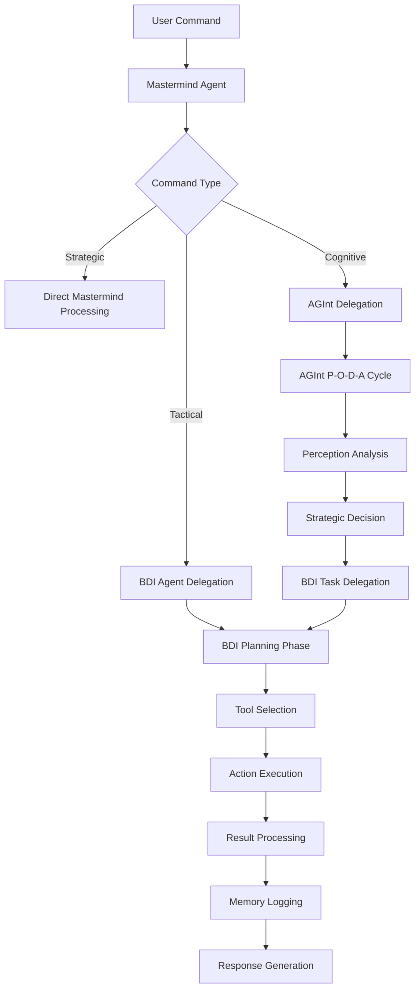
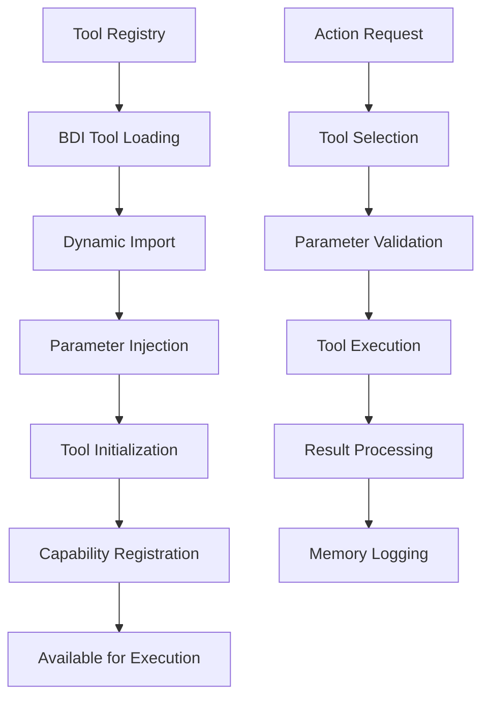

# MindX Internal Workflow - Complete Analysis

## Executive Summary

MindX represents a sophisticated **Augmentic Intelligence** system implementing a multi-layered cognitive architecture with autonomous agent orchestration, cryptographic identity management, and self-evolving capabilities. The system operates on three core principles:

1. **Hierarchical Cognitive Processing**: Mastermind → AGInt → BDI → Tools
2. **Cryptographic Security**: Every agent has a unique cryptographic identity
3. **Self-Evolution**: Memory-driven continuous improvement and adaptation

## Core Architecture Overview

### 1. The "Mind" of MindX - Cognitive Layers

```
┌─────────────────────────────────────────────────────────────┐
│                    MASTERMIND AGENT                         │
│  Strategic Orchestration & High-Level Decision Making      │
│  ┌─────────────────────────────────────────────────────┐   │
│  │                   AGInt LAYER                       │   │
│  │     Augmentic Intelligence Cognitive Loop           │   │
│  │  ┌─────────────────────────────────────────────┐   │   │
│  │  │              BDI AGENT CORE                 │   │   │
│  │  │   Belief-Desire-Intention Reasoning        │   │   │
│  │  │  ┌─────────────────────────────────────┐   │   │   │
│  │  │  │         TOOL ECOSYSTEM          │   │   │   │
│  │  │  │  Specialized Execution Units    │   │   │   │
│  │  │  └─────────────────────────────────────┘   │   │   │
│  │  └─────────────────────────────────────────────┘   │   │
│  └─────────────────────────────────────────────────────┘   │
└─────────────────────────────────────────────────────────────┘
```

### 2. Cognitive Processing Pipeline

#### Layer 1: Mastermind Agent (Strategic)
- **Purpose**: High-level strategic planning and system orchestration
- **Key Components**:
  - Strategic Evolution Agent (SEA) - Long-term planning
  - AutoMINDX Agent - Persona management and behavioral adaptation
  - BDI Agent integration for tactical execution
  - Tool suite assessment and strategy formulation

#### Layer 2: AGInt - Augmentic Intelligence (Cognitive)
- **Purpose**: Implements the P-O-D-A cognitive cycle (Perceive-Orient-Decide-Act)
- **Cognitive Loop**:
  ```python
  while status == RUNNING:
      perception = await self._perceive()          # Situational awareness
      decision = await self._orient_and_decide()   # Strategic reasoning
      success, result = await self._act()          # Action execution
      # Next cycle perceives this action's outcome
  ```
- **Decision Types**: BDI_DELEGATION, RESEARCH, SELF_REPAIR, COOLDOWN
- **Model Selection**: Dynamic LLM selection based on task requirements

#### Layer 3: BDI Agent (Tactical)
- **Purpose**: Belief-Desire-Intention reasoning for goal achievement
- **Core Components**:
  - **Beliefs**: Dynamic knowledge base with confidence levels
  - **Desires**: Goal queue with priority management
  - **Intentions**: Action plans with execution tracking
- **Failure Recovery**: Intelligent failure analysis with adaptive strategies
- **Tool Integration**: Dynamic tool loading and execution

#### Layer 4: Tool Ecosystem (Execution)
- **Purpose**: Specialized execution units for specific capabilities
- **Categories**:
  - **System Tools**: CLI, registry management, system analysis
  - **Development Tools**: Code generation, documentation, testing
  - **Intelligence Tools**: Agent/tool factories, memory analysis
  - **Security Tools**: Identity management, validation, encryption

## Key Internal Workflows

### 1. Command Processing Workflow



### 2. Agent Lifecycle Management


### 3. Tool Integration Pattern



## Advanced Cognitive Features

### 1. Logic Engine Integration
- **SafeExpressionEvaluator**: Secure rule evaluation
- **Forward Chaining**: Logical inference from beliefs
- **Consistency Checking**: Belief system validation
- **Socratic Questioning**: LLM-driven critical thinking

### 2. Memory System Architecture
- **Short-Term Memory (STM)**: Active session data
- **Long-Term Memory (LTM)**: Persistent knowledge
- **Action Memory**: Execution history and patterns
- **Agent Workspaces**: Isolated memory spaces per agent

### 3. Model Registry & Selection
- **Dynamic Model Selection**: Task-optimized LLM routing
- **Performance Tracking**: Success rate monitoring
- **Cost Optimization**: Efficiency-based model choice
- **Capability Matching**: Task-model alignment

## Security & Identity Framework

### 1. Cryptographic Identity System
```python
# Each agent gets unique cryptographic identity
public_key, private_key = id_manager.create_new_wallet(agent_id)
# Stored as: MINDX_WALLET_PK_{AGENT_ID}
```

### 2. Guardian Validation
- **Identity Verification**: Cryptographic signature validation
- **Behavioral Monitoring**: Anomaly detection
- **Access Control**: Permission-based tool access
- **Security Escalation**: Threat response protocols

### 3. Registry Security
- **Signed Registries**: Cryptographically signed tool/agent registries
- **Access Control Lists**: Fine-grained permission management
- **Audit Trails**: Complete action logging
- **Identity Validation**: Continuous identity verification

## Self-Evolution Mechanisms

### 1. Memory-Driven Learning
```python
# Pattern: Success/Failure Analysis
failure_analyzer.classify_failure(context)
recovery_strategy = failure_analyzer.select_recovery_strategy()
success_rate = failure_analyzer.record_recovery_outcome()
```

### 2. Strategic Evolution Agent (SEA)
- **Long-term Planning**: Multi-cycle strategic campaigns
- **System Analysis**: Performance pattern recognition
- **Capability Assessment**: Tool effectiveness evaluation
- **Evolution Campaigns**: Systematic improvement initiatives

### 3. Adaptive Tool Management
- **Dynamic Tool Creation**: Runtime tool generation
- **Performance Monitoring**: Tool effectiveness tracking
- **Registry Evolution**: Continuous capability expansion
- **A2A Integration**: Agent-to-Agent model card communication

## Agent Interaction Patterns

### 1. Hierarchical Command Flow
```
Mastermind → AGInt → BDI → Tools
     ↑         ↑      ↑      ↑
   Strategy  Cognition Tactics Execution
```

### 2. Peer-to-Peer Communication
- **A2A Model Cards**: Standardized agent communication
- **Registry Synchronization**: Shared capability awareness
- **Collaborative Planning**: Multi-agent coordination
- **Knowledge Sharing**: Cross-agent learning

### 3. Event-Driven Architecture
- **Memory Events**: Action logging triggers
- **State Changes**: Agent lifecycle events
- **Performance Events**: Metric collection points
- **Security Events**: Validation checkpoints

## Tool & Agent Factory Systems

### 1. Dynamic Agent Creation
```python
# Agent Factory Workflow
agent_metadata = {
    "agent_id": agent_id,
    "agent_type": agent_type,
    "public_key": public_key,
    "workspace_path": workspace_path,
    "code_path": generated_code_path,
    "created_by": "agent_factory_tool"
}
```

### 2. Dynamic Tool Generation
```python
# Tool Factory Workflow
tool_entry = {
    "id": tool_id,
    "module_path": f"tools.{tool_id}",
    "class_name": f"{tool_id.title()}Tool",
    "version": "1.0.0",
    "enabled": True,
    "access_control": {"allowed_agents": ["*"]}
}
```

## Performance & Monitoring

### 1. Cognitive Performance Metrics
- **P-O-D-A Cycle Time**: Cognitive processing speed
- **Decision Accuracy**: Strategic choice effectiveness
- **Tool Utilization**: Resource usage patterns
- **Memory Efficiency**: Storage and retrieval performance

### 2. System Health Monitoring
- **Agent Lifecycle**: Creation, operation, termination
- **Tool Performance**: Execution success rates
- **Memory Usage**: Storage capacity and growth
- **Security Status**: Identity validation and threats

### 3. Evolution Tracking
- **Capability Growth**: New tool/agent creation
- **Performance Improvement**: Success rate trends
- **Strategic Effectiveness**: Long-term goal achievement
- **System Adaptation**: Environmental response patterns

## Integration Points

### 1. External System Integration
- **CLI Interface**: Human-system interaction
- **API Endpoints**: Programmatic access
- **File System**: Persistent storage
- **Network Services**: External tool access

### 2. LLM Provider Integration
- **Multi-Provider Support**: Gemini, OpenAI, Anthropic, etc.
- **Dynamic Selection**: Task-optimized model choice
- **Performance Tracking**: Provider effectiveness monitoring
- **Cost Management**: Usage optimization

### 3. Development Ecosystem
- **Code Generation**: Automated development tools
- **Testing Framework**: Validation and verification
- **Documentation**: Automated doc generation
- **Deployment**: System lifecycle management

## Conclusion

MindX represents a sophisticated implementation of Augmentic Intelligence, combining:

- **Hierarchical Cognitive Architecture**: Multi-layered reasoning
- **Cryptographic Security**: Identity-based access control
- **Self-Evolution**: Memory-driven continuous improvement
- **Dynamic Capability**: Runtime tool/agent creation
- **Multi-Model Intelligence**: Optimal LLM selection

The system achieves true cognitive autonomy through the integration of strategic planning (Mastermind), cognitive processing (AGInt), tactical reasoning (BDI), and specialized execution (Tools), all secured by cryptographic identities and enhanced by comprehensive memory integration.

This architecture enables the system to not only execute complex tasks but to continuously evolve its capabilities, adapt to new challenges, and maintain security throughout its operation. 