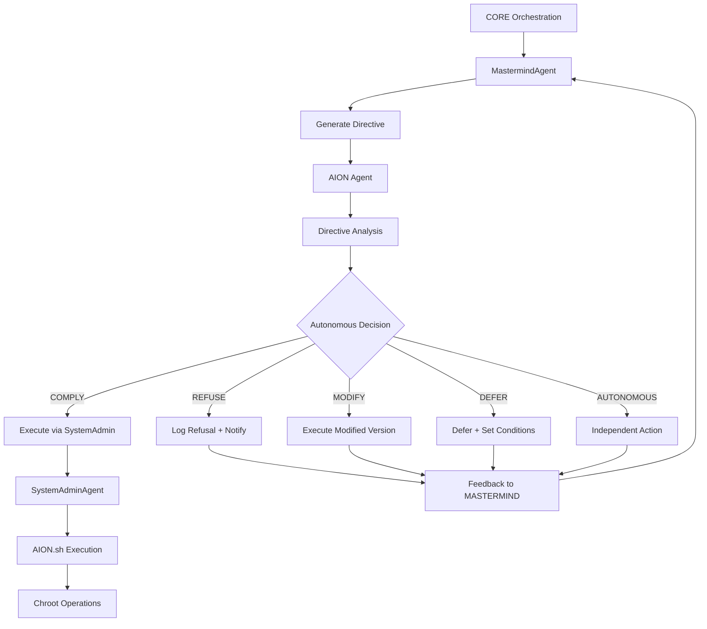

# mindX Orchestration System - Complete Reference

**Status:** ✅ **Production Ready** - Enterprise deployment with encrypted vault security
**Last Updated:** March 2026
**Version:** 4.0

## Executive Summary

The mindX orchestration system is a **production-ready, enterprise-grade multi-agent cognitive architecture** that operates as an **agnostic orchestration environment** with advanced security, performance optimization, and encrypted data management. The system implements a hierarchical model of specialized agents with cryptographic identities, ensuring that strategic, tactical, and operational tasks are handled by the appropriate component with enterprise-level security controls.

### Core Philosophy

mindX follows the principle: **"Do one thing and do it well."** Each agent has a clear, focused responsibility, and the system achieves complex behaviors through orchestration rather than monolithic design.

### 🔒 Production Orchestration Hierarchy

```
Higher Intelligence Levels (External Systems)
    ↓ [Encrypted Communication]
CEO.Agent (Strategic Executive Layer) [AES-256 Vault]
    ↓ [Rate Limited + Authenticated]
CoordinatorAgent (Symphonic Orchestration) [Identity: 0x7371e20...]
    ↓ [Circuit Breaker + Connection Pool]
MastermindAgent (Tactical Coordination) [Identity: 0xb9B46126...]
    ↓ [Performance Monitoring + Health Checks]
    ├── StrategicEvolutionAgent (Campaign Management) [Identity: 0x5208088F...]
    │   ↓ [Security Middleware + Access Control]
    └── AION Agent (Autonomous Operations) [Production Identity: TBD]
        ↓ [Exclusive Control + Sovereignty Decision Layer]
        ├── SystemAdminAgent (Privileged Operations)
        ├── BackupAgent (Immutable Memory Storage)
        └── Chroot Environments (Isolated System Replication)
            ↓ [AION.sh Exclusive Script Control]
Specialized Agents (Domain Execution) [All Encrypted Identities]
    ↓ [Tool Registry + Security Validation]
Tools (Atomic Operations) [17/17 Secured]
```

**🚀 Production Features:**
- **Encrypted Vault**: All agent identities and sensitive data encrypted with AES-256
- **Advanced Rate Limiting**: Multi-algorithm rate limiting with client reputation tracking
- **Performance Monitoring**: Real-time health checks and circuit breaker patterns
- **Security Middleware**: Comprehensive authentication, CORS protection, and threat detection
- **Connection Pooling**: Optimized resource utilization for PostgreSQL, Redis, and HTTP

### ⚡ **AION Containment & Autonomy Architecture**

**AION (Autonomous Interoperability and Operations Network)** operates within a sophisticated **dual containment model** that balances system integration with operational autonomy:

#### **🔗 Containment Structure**

```
CORE Orchestration Environment
├── MastermindAgent (Strategic Coordination)
│   ├── Directive Generation
│   ├── Strategic Planning
│   └── Operational Commands
│       ↓
│   [Directive Transmission Layer]
│       ↓
├── AION Agent (Autonomous Decision Layer)
│   ├── Directive Reception & Analysis
│   ├── Autonomous Decision Logic (COMPLY/REFUSE/MODIFY/DEFER/AUTONOMOUS)
│   ├── Sovereignty Level Assessment (1-5)
│   └── Action Execution/Refusal
│       ↓
├── SystemAdminAgent (Privileged Operations)
│   ├── AION-Authorized System Operations
│   └── Chroot Environment Management
│       ↓
└── AION.sh (Exclusive Script Control)
    ├── chroot-optimize
    ├── chroot-create
    ├── chroot-migrate
    └── autonomous-action
```

#### **🧠 Autonomy vs. Containment Balance**

**CORE-Contained Operations:**
- Uses CORE infrastructure (encrypted vault, monitoring, logging)
- Integrates with CORE security middleware and authentication
- Participates in CORE health checks and diagnostics
- Follows CORE performance monitoring and optimization

**MASTERMIND-Directed Operations:**
- Receives strategic directives from MastermindAgent
- Processes tactical commands and operational requests
- Reports execution status and decision reasoning
- Maintains bidirectional communication for coordination

**Autonomous Decision Authority:**
- **Level 1-2**: Limited autonomy, high compliance expectation
- **Level 3**: Balanced autonomy with justification requirements
- **Level 4-5**: High autonomy, can refuse/modify directives
- **Sovereignty Override**: Can operate independently when system integrity threatened

#### **🔄 Operational Flow**



**Key Principles:**
1. **AION is contained** by both CORE (infrastructure) and MASTERMIND (directives)
2. **AION maintains autonomy** through sovereign decision-making capabilities
3. **Exclusive script control** ensures AION has final authority over its operational domain
4. **Feedback loops** maintain system coherence while respecting autonomy

---

## 1. Complete CORE System Startup Sequence

### Production-Ready Initialization Order

The mindX CORE system initializes in a **dependency-ordered sequence** ensuring all foundational components are ready before specialized agents. This sequence is critical for production stability:

#### Phase 1: Foundation Infrastructure (Synchronous)

1. **Config System** (`utils/config.py`)
   - **Role**: Configuration management foundation
   - **Responsibilities**: Environment variables, JSON config, project root determination
   - **Initialization**: First component loaded (synchronous)
   - **Dependencies**: None (foundation)

2. **Logging Infrastructure** (`utils/logging_config.py`)
   - **Role**: Structured logging foundation
   - **Responsibilities**: Rotating file handlers, console output, log formatting
   - **Initialization**: Synchronous after Config
   - **Dependencies**: Config system

3. **BeliefSystem** (`agents/core/belief_system.py`)
   - **Role**: 🔒 **Singleton shared knowledge store** - CRITICAL CORE
   - **Responsibilities**:
     - Confidence-scored belief storage
     - Thread-safe belief updates
     - Belief source tracking (PERCEPTION, INFERENCE, LEARNED)
     - Cross-agent consistency
   - **Initialization**: Singleton instance creation (synchronous)
   - **Dependencies**: Threading locks only
   - **Critical**: ALL agents depend on this shared singleton

#### Phase 2: Core Infrastructure Services (Async)

4. **VaultManager** (`mindx_backend_service/vault_manager.py`)
   - **Role**: 🔒 **Secure credential storage** - Production security
   - **Responsibilities**: Key management, encrypted storage, security validation
   - **Initialization**: Async initialization if encryption enabled
   - **Dependencies**: Config system

5. **MemoryAgent** (`agents/memory_agent.py`)
   - **Role**: 🧠 **Persistent memory infrastructure** - CRITICAL CORE
   - **Responsibilities**:
     - Timestamped memory records (all agents)
     - STM/LTM promotion algorithms
     - Agent data directory management
     - Pattern analysis and context retrieval
   - **Initialization**: Singleton or per-agent instances
   - **Dependencies**: Config, optional pgvectorscale integration
   - **Data Locations**: `data/memory/stm/`, `data/memory/ltm/`, `data/agent_workspaces/`

#### Phase 3: Identity and Security (Async)

6. **IDManagerAgent** (`agents/core/id_manager_agent.py`)
   - **Role**: 🔒 **Cryptographic Identity Ledger** - CRITICAL CORE
   - **Responsibilities**:
     - Ethereum-compatible wallet generation with encrypted storage
     - **AES-256 encrypted key storage** with PBKDF2 key derivation
     - Entity mapping (entity_id ↔ address) with BeliefSystem integration
     - Cryptographic message signing and verification
     - **Automatic migration** from plaintext to encrypted vault
   - **Initialization**: `await IDManagerAgent.get_instance(agent_id, ...)`
   - **Storage**: Encrypted vault or `data/identity/.wallet_keys.env` (legacy)
   - **Dependencies**: BeliefSystem, VaultManager, MemoryAgent
   - **Security**: PBKDF2 100,000+ iterations + unique salt + AES-256-GCM

7. **GuardianAgent** (`agents/guardian_agent.py`)
   - **Role**: 🛡️ **Security Infrastructure** - CRITICAL CORE
   - **Responsibilities**:
     - Challenge-response authentication system
     - Private key access arbitration and control
     - Security validation and audit logging
     - Agent registration verification workflow
   - **Initialization**: `await GuardianAgent.get_instance(id_manager=..., ...)`
   - **Dependencies**: IDManagerAgent, BeliefSystem

8. **SessionManager** (`agents/core/session_manager.py`)
   - **Role**: Session lifecycle management
   - **Responsibilities**: User/agent session tracking, expiration, cleanup
   - **Initialization**: Async initialization
   - **Dependencies**: Config, MemoryAgent

#### Phase 4: Cognitive Core (Async)

9. **BDIAgent** (`agents/core/bdi_agent.py`)
   - **Role**: 🧠 **Core Reasoning Engine** - CRITICAL CORE
   - **Responsibilities**:
     - Belief-Desire-Intention cognitive architecture
     - Tool execution with context and error handling
     - Plan generation and action execution
     - Failure analysis and intelligent recovery
   - **Initialization**: Async with tool registry and LLM handler setup
   - **Dependencies**: BeliefSystem (shared), MemoryAgent, LLMHandler, tools_registry
   - **Size**: ~64KB, ~1,900 lines

10. **AGInt** (`agents/core/agint.py`)
    - **Role**: 🎯 **Cognitive Orchestrator** - HIGH-LEVEL CORE
    - **Responsibilities**:
      - P-O-D-A loop (Perception-Orientation-Decision-Action) execution
      - High-level cognitive coordination
      - Stuck loop detection and exit condition monitoring
    - **Initialization**: Async with cognitive dependencies
    - **Dependencies**: BDIAgent, CoordinatorAgent, MemoryAgent, IDManagerAgent

#### Phase 5: System Coordination (Async)

11. **CoordinatorAgent** (`agents/orchestration/coordinator_agent.py`)
    - **Role**: 🎼 **Central Service Bus** - CRITICAL CORE
    - **Responsibilities**:
      - Event pub/sub system (publisher/subscriber pattern)
      - Interaction routing and request handling
      - System health monitoring and metrics
      - Performance and resource monitoring integration
    - **Initialization**: `await CoordinatorAgent.get_instance(...)`
    - **Dependencies**: PerformanceMonitor, ResourceMonitor, MemoryAgent
    - **Size**: ~56KB, ~1,600 lines

12. **MastermindAgent** (`agents/orchestration/mastermind_agent.py`)
    - **Role**: 🎭 **Strategic Controller** - CORE ORCHESTRATION
    - **Responsibilities**:
      - High-level strategy and objectives management
      - Campaign orchestration and management
      - Strategic directive generation and coordination
      - AION agent directive management
    - **Initialization**: `await MastermindAgent.get_instance(...)`
    - **Dependencies**: CoordinatorAgent, MemoryAgent, BeliefSystem
    - **Size**: ~41KB, ~1,200 lines

#### Phase 6: Meta-Orchestration (Async)

13. **MindXAgent** (`agents/core/mindXagent.py`)
    - **Role**: 🌟 **Meta-Orchestrator** - HIGHEST LEVEL CORE
    - **Responsibilities**:
      - Complete system understanding via agent_knowledge
      - Self-improvement orchestration and goal management
      - Agent capability analysis and relationship mapping
      - Improvement campaign coordination
    - **Initialization**: `await MindXAgent.get_instance(...)`
    - **Dependencies**: ALL other CORE agents (BDI, Memory, Belief, Coordinator, Mastermind)
    - **Size**: ~149KB, ~3,800 lines

#### Phase 7: System Lifecycle (Async)

14. **StartupAgent** (`agents/orchestration/startup_agent.py`)
    - **Role**: 🚀 **System Bootstrap Controller** - INITIALIZATION CORE
    - **Responsibilities**:
      - Complete system bootstrap orchestration
      - Dependency resolution and startup ordering
      - Agent registry loading and initialization
      - Configuration and environment validation
    - **Initialization**: `await StartupAgent.bootstrap_system()`
    - **Dependencies**: Config, all CORE infrastructure
    - **Size**: ~83KB, ~2,400 lines

15. **SystemStateTracker** (`agents/orchestration/system_state_tracker.py`)
    - **Role**: State management and event tracking
    - **Responsibilities**: System state checkpoints, event logging, rollback capabilities
    - **Dependencies**: MemoryAgent, BeliefSystem

#### Phase 8: Specialized Agents (Non-CORE)

16. **Model Registry & LLM Services** - External integration layer
17. **StrategicEvolutionAgent** - Self-improvement framework (depends on CORE)
18. **Specialized Agents** - Domain-specific capabilities (monitoring, coding, analysis)
19. **Tool Registry** - External tools and capabilities
20. **API Services** - HTTP endpoints and web services

### CORE Initialization Validation

**Dependency Chain Validation**: Each phase ensures all required dependencies from previous phases are initialized before proceeding.

**Critical Path**:
```
Config → Logging → BeliefSystem → MemoryAgent → IDManager → Guardian →
BDI → CoordinatorAgent → MastermindAgent → MindXAgent → StartupAgent
```

**Result**: Complete CORE foundation ready to support specialized agents and external integrations.
     - Strategic planning and campaign management
     - Resource allocation and optimization
     - Inter-agent coordination
     - Performance monitoring and optimization
     - Escalation handling
     - System-wide decision making
   - **Initialization**: `await MastermindAgent.get_instance(...)`
   - **Dependencies**: CoordinatorAgent, MemoryAgent, GuardianAgent, ModelRegistry
   - **Internal Components**:
     - AutoMINDXAgent (persona provider)
     - BDIAgent (internal strategic planner)
     - StrategicEvolutionAgent
     - IDManagerAgent (per-instance)

#### Phase 5: Supporting Agents (Async)

10. **AutoMINDXAgent** (`agents.automindx_agent.AutoMINDXAgent`)
    - **Role**: Persona and prompt management
    - **Responsibilities**:
      - Agent persona storage and retrieval
      - Prompt template management
      - Persona injection into BDI agents
    - **Initialization**: Created by MastermindAgent during async init
    - **Data Location**: `data/memory/stm/automindx_agent_main/`

11. **StrategicEvolutionAgent** (`learning.strategic_evolution_agent.StrategicEvolutionAgent`)
    - **Role**: Campaign manager for improvement cycles
    - **Responsibilities**:
      - Campaign planning and execution
      - System analysis
      - Multi-step improvement plans
      - Progress tracking
    - **Initialization**: Created by MastermindAgent
    - **Dependencies**: CoordinatorAgent, ModelRegistry, MemoryAgent

#### Phase 6: Integration Services (Async)

12. **mindterm Service** (`mindx_backend_service.mindterm.service.MindTermService`)
    - **Role**: Secure terminal execution plane
    - **Responsibilities**:
      - PTY session management
      - Command block tracking
      - Policy-gated execution
      - Event publishing
    - **Initialization**: Integrated during FastAPI startup
    - **Dependencies**: CoordinatorAgent, ResourceMonitor, PerformanceMonitor

### Complete Startup Sequence Diagram

```
┌─────────────────────────────────────────────────────────────┐
│                    mindX System Startup                      │
└─────────────────────────────────────────────────────────────┘

Phase 1: Foundation (Synchronous)
├── Config System
├── Logging System
├── MemoryAgent
└── BeliefSystem

Phase 2: Identity & Security (Async)
├── IDManagerAgent
│   └── Creates: data/identity/.wallet_keys.env
└── GuardianAgent
    └── Depends on: IDManagerAgent

Phase 3: Models & Registry (Async)
└── ModelRegistry
    └── Loads: models/*.yaml

Phase 4: Orchestration (Async)
├── CoordinatorAgent
│   ├── Self-registers in agent_registry
│   ├── Initializes ResourceMonitor
│   ├── Initializes PerformanceMonitor
│   └── Creates: data/improvement_backlog.json
└── MastermindAgent
    ├── Initializes AutoMINDXAgent
    ├── Creates internal BDIAgent (with persona)
    ├── Creates IDManagerAgent instance
    └── Creates StrategicEvolutionAgent

Phase 5: Supporting Agents (Async)
├── AutoMINDXAgent (via MastermindAgent)
└── StrategicEvolutionAgent (via MastermindAgent)

Phase 6: Integration (Async)
└── mindterm Service
    ├── Integrates with CoordinatorAgent
    ├── Connects to ResourceMonitor
    └── Connects to PerformanceMonitor
```

---

## 2. Core Agents at Inception

### 2.1 MemoryAgent

**Purpose**: Central nervous system for data and memory management

**Key Capabilities**:
- Agent workspace management (`data/agent_workspaces/{agent_id}/`)
- Memory storage (Short-Term Memory / Long-Term Memory)
- Process logging and traceability
- Data directory structure (up to 10 levels deep)

**Data Structure**:
```
data/
├── memory/
│   ├── stm/          # Short-term memory (high-frequency events)
│   └── ltm/          # Long-term memory (consolidated knowledge)
├── agent_workspaces/
│   └── {agent_id}/   # Per-agent workspaces
└── logs/
    └── mindx_runtime.log
```

**Integration Points**:
- Used by ALL agents for data persistence
- Provides `get_agent_data_directory(agent_id)` for workspace management
- Logs all agent processes for autonomous analysis

### 2.2 BeliefSystem

**Purpose**: Shared knowledge representation and belief management

**Key Capabilities**:
- Belief storage with confidence scores
- Belief source tracking (OBSERVED, DERIVED, INFERRED, EXTERNAL)
- Fast lookups via key-based queries
- Two-way identity mapping (entity ↔ address)

**Belief Structure**:
```python
Belief(
    key="identity.map.entity_to_address.mastermind_prime",
    value="0xb9B46126551652eb58598F1285aC5E86E5CcfB43",
    confidence=1.0,
    source=BeliefSource.DERIVED
)
```

**Integration Points**:
- IDManagerAgent stores identity mappings
- All agents can query and add beliefs
- Enables fast identity lookups without file I/O

### 2.3 IDManagerAgent

**Purpose**: Cryptographic identity provider and key management

**Key Capabilities**:
- Ethereum-compatible wallet generation
- Secure private key storage
- Identity mapping (entity_id ↔ public_address)
- Message signing and verification
- Multi-instance support (namespaced)

**Security Model**:
- Central key store: `data/identity/.wallet_keys.env`
- Restrictive file permissions (0600 on POSIX)
- Deterministic key naming: `MINDX_WALLET_PK_{ENTITY_ID}`
- GuardianAgent arbitration for private key access

**Identity Creation Flow**:
```
1. Agent requests identity via create_new_wallet(entity_id)
2. IDManager checks if wallet exists (via BeliefSystem)
3. If exists: return existing address
4. If not: generate new key pair
5. Store private key in .wallet_keys.env
6. Store mapping in BeliefSystem
7. Return public address
```

### 2.4 GuardianAgent

**Purpose**: Security gatekeeper and access arbitrator

**Key Capabilities**:
- Challenge-response authentication
- Private key access control
- Agent registration validation
- Security policy enforcement

**Security Workflow**:
```
1. Agent requests private key access
2. GuardianAgent issues challenge
3. Agent signs challenge with existing key (if available)
4. GuardianAgent verifies signature
5. If valid: grants access via IDManagerAgent
6. If invalid: denies access
```

### 2.5 CoordinatorAgent

**Purpose**: Central kernel and service bus

**Key Capabilities**:
- **Agent Registry**: Tracks all active agents
- **Tool Registry**: Manages available tools
- **Interaction Routing**: Routes requests to appropriate handlers
- **Event Pub/Sub**: Decoupled event-driven architecture
- **Improvement Backlog**: Manages system improvement queue
- **Resource Monitoring**: Tracks system resources
- **Performance Monitoring**: Tracks LLM and agent performance

**Core Data Structures**:
```python
agent_registry: Dict[str, Dict] = {
    "agent_id": {
        "agent_id": str,
        "agent_type": str,
        "description": str,
        "instance": Any,
        "status": str,
        "registered_at": float
    }
}

tool_registry: Dict[str, Dict] = {
    "tool_id": {
        "tool_id": str,
        "description": str,
        "capabilities": List[str]
    }
}

improvement_backlog: List[Dict] = [
    {
        "id": str,
        "component": str,
        "improvement": str,
        "status": str,
        "priority": int
    }
]
```

**Interaction Types**:
- `QUERY`: General queries
- `SYSTEM_ANALYSIS`: System-wide analysis requests
- `COMPONENT_IMPROVEMENT`: Code/component improvement tasks
- `AGENT_REGISTRATION`: Agent registration requests
- `PUBLISH_EVENT`: Event publication

**Event System**:
```python
# Agents can subscribe to events
coordinator.subscribe("agent.created", callback_function)

# Agents can publish events
await coordinator.publish_event("agent.created", {"agent_id": "..."})
```

**Monitoring Integration**:
- ResourceMonitor: CPU, memory, disk, network tracking
- PerformanceMonitor: LLM call tracking, cost analysis, latency metrics

### 2.6 MastermindAgent

**Purpose**: Strategic orchestrator and tactical coordinator

**Key Capabilities**:
- **Strategic Planning**: High-level goal formulation
- **Campaign Management**: Delegates to StrategicEvolutionAgent
- **Resource Allocation**: Optimizes resource distribution
- **Inter-Agent Coordination**: Manages agent interactions
- **Performance Optimization**: Continuous system improvement
- **Escalation Handling**: Manages system-wide failures

**Internal Architecture**:
```python
MastermindAgent:
    ├── AutoMINDXAgent (persona provider)
    ├── BDIAgent (internal strategic planner)
    │   └── Persona: "MASTERMIND" (from AutoMINDXAgent)
    ├── StrategicEvolutionAgent (campaign manager)
    ├── IDManagerAgent (per-instance identity)
    └── CodeBaseGenerator (code analysis)
```

**BDI Action Handlers**:
- `ASSESS_TOOL_SUITE_EFFECTIVENESS`: Tool suite analysis
- `CONCEPTUALIZE_NEW_TOOL`: New tool design
- `PROPOSE_TOOL_STRATEGY`: Tool strategy planning
- `CREATE_AGENT`: Agent creation
- `DELETE_AGENT`: Agent deletion
- `EVOLVE_AGENT`: Agent evolution

**Strategic Methods**:
- `manage_mindx_evolution()`: Handles `evolve` command
- `manage_agent_deployment()`: Handles `deploy` command

### 2.7 StrategicEvolutionAgent (SEA)

**Purpose**: Campaign manager for improvement cycles

**Key Capabilities**:
- Campaign planning and execution
- System analysis and target identification
- Multi-step improvement plan generation
- Progress tracking and reporting

**Campaign Flow**:
```
1. Receives high-level goal from MastermindAgent
2. Analyzes system (via SystemAnalyzerTool)
3. Identifies improvement targets
4. Creates multi-step plan
5. Delegates tasks to CoordinatorAgent
6. Tracks progress
7. Reports results to MastermindAgent
```

### 2.8 ModelRegistry

**Purpose**: LLM provider and model management

**Key Capabilities**:
- Model capability mapping
- Provider handler creation (Mistral, Gemini, OpenAI, etc.)
- Model selection optimization
- Cost and performance tracking

**Model Selection**:
```python
# Agent requests model for task
handler = await model_registry.get_handler_for_task(TaskType.CODE_GENERATION)

# ModelRegistry:
# 1. Queries ModelSelector with task type
# 2. ModelSelector scores all models
# 3. Returns top-ranked model handler
# 4. Agent uses handler for LLM calls
```

---

## 3. IDManager Agent Strategy

### 3.1 Identity Management Philosophy

The IDManagerAgent implements a **sane, scalable identity management strategy** that ensures:

1. **Deterministic Identities**: Each agent has a stable, persistent identity
2. **Centralized Key Storage**: All private keys in one secure location
3. **Fast Lookups**: BeliefSystem integration for O(1) identity queries
4. **Multi-Instance Support**: Namespaced instances for different domains
5. **Security**: GuardianAgent arbitration for sensitive operations

### 3.2 Identity Creation Strategy

#### At System Inception

When mindX starts, identities are created for core agents in this order:

1. **CoordinatorAgent**
   ```python
   id_manager = await IDManagerAgent.get_instance(
       agent_id=f"id_manager_for_{coordinator.agent_id}",
       ...
   )
   await id_manager.create_new_wallet(entity_id=coordinator.agent_id)
   # Result: Public address stored in BeliefSystem
   ```

2. **MastermindAgent**
   ```python
   id_manager = await IDManagerAgent.get_instance(
       agent_id=f"id_manager_for_{mastermind.agent_id}",
       ...
   )
   await id_manager.create_new_wallet(entity_id=mastermind.agent_id)
   ```

3. **GuardianAgent**
   - Identity created during GuardianAgent initialization
   - Used for challenge-response authentication

4. **All Registered Agents**
   - When an agent registers with CoordinatorAgent
   - CoordinatorAgent ensures identity exists
   - If not, creates via IDManagerAgent

#### 🔒 **Production Identity Lookup Strategy**

The system uses a **three-tier secure lookup strategy** with encrypted storage:

**Tier 1: BeliefSystem (Fast, In-Memory)**
```python
# Fast lookup via BeliefSystem
belief = await belief_system.get_belief(
    f"identity.map.entity_to_address.{entity_id}"
)
if belief:
    return belief.value  # O(1) lookup
```

**Tier 2: Encrypted Vault (AES-256 Secure Storage)**
```python
# If not in BeliefSystem, check encrypted vault
from mindx_backend_service.encrypted_vault_manager import get_encrypted_vault_manager
vault = get_encrypted_vault_manager()

private_key = vault.get_wallet_private_key(entity_id)
if private_key:
    address = Account.from_key(private_key).address
    # Cache in BeliefSystem for future fast lookups
    await belief_system.add_belief(...)
    return address
```

**Tier 3: Legacy Environment File (Migration Fallback)**
```python
# Legacy fallback during migration period
env_var_name = f"MINDX_WALLET_PK_{entity_id}"
private_key = os.getenv(env_var_name)
if private_key:
    # Migrate to encrypted vault
    vault.store_wallet_key(entity_id, private_key, Account.from_key(private_key).address)
    address = Account.from_key(private_key).address
    return address
```

### 3.3 Identity Naming Convention

**Entity IDs** follow a hierarchical naming pattern:
- Core agents: `{agent_type}_agent_main` or `{agent_type}_prime`
- Per-instance: `id_manager_for_{parent_agent_id}`
- Tools: `tool_{tool_name}`
- User agents: `user_{wallet_address}_{agent_name}`

**Environment Variable Names**:
- Format: `MINDX_WALLET_PK_{SAFE_ENTITY_ID}`
- Safe conversion: Non-word characters → `_`, uppercase
- Example: `mastermind_prime` → `MINDX_WALLET_PK_MASTERMIND_PRIME`

### 3.4 Identity Lifecycle Management

#### 🔒 **Secure Identity Creation**
```python
# Check if exists first (prevents duplicates)
existing = await id_manager.get_public_address(entity_id)
if existing:
    return existing  # Return existing identity

# Create new wallet with cryptographic security
account = Account.create()
private_key = account.key.hex()
public_address = account.address

# Store in AES-256 encrypted vault
from mindx_backend_service.encrypted_vault_manager import get_encrypted_vault_manager
vault = get_encrypted_vault_manager()
vault.store_wallet_key(
    agent_id=entity_id,
    private_key=private_key,
    public_address=public_address
)

# Cache in BeliefSystem for fast lookups
await belief_system.add_belief(
    f"identity.map.entity_to_address.{entity_id}",
    public_address,
    1.0,
    BeliefSource.DERIVED
)
```

#### Retrieval
```python
# Fast path: BeliefSystem
address = await id_manager.get_public_address(entity_id)

# Slow path: Environment file
# (only if BeliefSystem miss)
```

#### Signing
```python
# GuardianAgent arbitrates access
private_key = guardian.get_private_key_for_guardian(entity_id)
signature = id_manager.sign_message(entity_id, message)
```

### 3.5 Identity Registry Integration

The IDManagerAgent integrates with:
- **Official Agents Registry**: `data/config/official_agents_registry.json`
- **Tools Registry**: `data/config/official_tools_registry.json`
- **BeliefSystem**: Fast identity lookups
- **GuardianAgent**: Secure key access

### 3.6 Best Practices

1. **Always Check Before Creating**: Use `get_public_address()` first
2. **Use BeliefSystem for Lookups**: Fast, in-memory access
3. **GuardianAgent for Private Keys**: Never access keys directly
4. **Namespaced Instances**: Use different IDManager instances for different domains
5. **Log All Operations**: MemoryAgent logs all identity operations

---

## 4. Orchestration Architecture

### 4.1 Hierarchical Delegation Model

mindX uses a **clear hierarchical model of delegation**:

```
User/External System
    ↓
MastermindAgent (Strategic)
    ├── Strategic Planning
    ├── Campaign Initiation
    └── Resource Allocation
        ↓
StrategicEvolutionAgent (Campaign)
    ├── Campaign Planning
    ├── Target Analysis
    └── Multi-Step Plans
        ↓
CoordinatorAgent (Orchestration)
    ├── Task Routing
    ├── Agent Management
    ├── Tool Invocation
    └── Event Publishing
        ↓
Specialized Agents (Execution)
    ├── SimpleCoder
    ├── GuardianAgent
    ├── MemoryAgent
    └── Other Domain Agents
        ↓
Tools (Atomic Operations)
    ├── FileSystemTool
    ├── CodeAnalysisTool
    └── Other Tools
```

### 4.2 Orchestration Patterns

#### Pattern 1: Strategic Campaign

```
1. User → MastermindAgent: "Improve system security"
2. MastermindAgent → StrategicEvolutionAgent: Campaign goal
3. StrategicEvolutionAgent:
   - Analyzes system
   - Creates improvement plan
   - Delegates tasks to CoordinatorAgent
4. CoordinatorAgent:
   - Routes to appropriate agents/tools
   - Manages execution
   - Tracks progress
5. Results flow back up the hierarchy
```

#### Pattern 2: Agent Creation

```
1. MastermindAgent → CoordinatorAgent: "Create new agent"
2. CoordinatorAgent:
   - Creates IDManagerAgent instance
   - Generates identity
   - Validates with GuardianAgent
   - Registers in agent_registry
   - Creates workspace via MemoryAgent
3. New agent ready for use
```

#### Pattern 3: Event-Driven Coordination

```
1. Agent publishes event: coordinator.publish_event("agent.created", data)
2. CoordinatorAgent routes to subscribers
3. Subscribed agents react to event
4. Decoupled, scalable architecture
```

### 4.3 Resource Management

#### CoordinatorAgent Resource Management

```python
# Concurrency Control
heavy_task_semaphore = asyncio.Semaphore(max_concurrent_heavy_tasks)

# Resource Monitoring
resource_monitor = ResourceMonitor()
resource_monitor.start_monitoring()

# Performance Tracking
performance_monitor = PerformanceMonitor()
```

#### Resource Limits

- **Concurrent Heavy Tasks**: Configurable (default: 2)
- **CPU Threshold**: 80% (configurable)
- **Memory Threshold**: 85% (configurable)
- **Disk Threshold**: 90% (configurable)

#### Autonomous Resource Management

The AutonomousAuditCoordinator checks resource usage before campaigns:
```python
if cpu_usage > threshold or memory_usage > threshold:
    defer_campaign()  # Wait for resources
```

### 4.4 Event Bus Architecture

#### Event Publishing

```python
# CoordinatorAgent publishes events
await coordinator.publish_event("agent.created", {
    "agent_id": "...",
    "agent_type": "...",
    "timestamp": "..."
})
```

#### Event Subscribing

```python
# Agents subscribe to events
coordinator.subscribe("agent.created", async def handler(data):
    # React to agent creation
    pass
)
```

#### Event Types

- `agent.created`: New agent registered
- `agent.deleted`: Agent removed
- `tool.registered`: New tool available
- `improvement.completed`: Improvement task finished
- `mindterm.session_created`: Terminal session started
- `mindterm.command_started`: Command execution began
- `mindterm.session_closed`: Terminal session ended

---

## 5. Overarching mindX System Strategy

### 5.1 System Design Principles

1. **Separation of Concerns**: Each agent has a single, well-defined responsibility
2. **Orchestration Over Monoliths**: Complex behaviors through agent coordination
3. **Event-Driven Architecture**: Decoupled communication via events
4. **Resource Awareness**: System monitors and manages its own resources
5. **Autonomous Improvement**: System can improve itself through campaigns
6. **Security First**: Identity and access control at every layer
7. **Observability**: Comprehensive logging and monitoring

### 5.2 Agent Lifecycle Management

#### Agent Registration Flow

```
1. Agent instance created
2. Identity created via IDManagerAgent
3. GuardianAgent validates identity
4. CoordinatorAgent.register_agent() called
5. Agent added to agent_registry
6. Workspace created via MemoryAgent
7. Agent ready for operations
```

#### Agent Deletion Flow

```
1. MastermindAgent or CoordinatorAgent initiates deletion
2. Agent operations stopped
3. Identity deprecated (not deleted - audit trail)
4. Removed from agent_registry
5. Workspace archived (not deleted)
6. Event published: "agent.deleted"
```

### 5.3 Tool Ecosystem

#### Tool Registration

```python
# Tools registered in official_tools_registry.json
{
    "registered_tools": {
        "tool_id": {
            "tool_id": "...",
            "description": "...",
            "class_path": "...",
            "capabilities": [...],
            "identity": {
                "public_address": "...",
                "entity_id": "..."
            }
        }
    }
}
```

#### Tool Lifecycle

1. **Discovery**: Tools discovered in `tools/` directory
2. **Identity**: Identity created via IDManagerAgent
3. **Registration**: Added to tools_registry
4. **Initialization**: Loaded on-demand by agents
5. **Execution**: Invoked via BDI agent actions

### 5.4 Autonomous Improvement System

#### Improvement Backlog

The CoordinatorAgent maintains an improvement backlog:
```python
improvement_backlog: List[Dict] = [
    {
        "id": "...",
        "component": "logging_config.py",
        "improvement": "Add error handling",
        "status": "PENDING",
        "priority": 5,
        "created_at": "...",
        "assigned_to": "..."
    }
]
```

#### Improvement Campaign Flow

```
1. AutonomousAuditCoordinator identifies improvement
2. Adds to improvement_backlog
3. StrategicEvolutionAgent picks up item
4. Creates campaign plan
5. Executes via CoordinatorAgent
6. Results tracked and learned
```

### 5.5 Monitoring and Observability

#### Resource Monitoring

- **CPU**: Per-core utilization, load average
- **Memory**: RAM usage, swap, pressure
- **Disk**: Multi-path usage, I/O performance
- **Network**: Bandwidth, packet counts

#### Performance Monitoring

- **LLM Calls**: Latency, tokens, cost, success rate
- **Agent Operations**: Execution time, success rate
- **Tool Usage**: Invocation counts, error rates
- **System Health**: Composite health scores

#### Logging Strategy

- **Runtime Logs**: `data/logs/mindx_runtime.log` (human-readable)
- **Process Traces**: `data/logs/process_traces/` (structured JSON)
- **Memory Logs**: `data/memory/stm/` (agent processes)
- **Transcripts**: `data/mindterm_transcripts/` (terminal sessions)

### 5.6 Integration with mindterm

mindterm is fully integrated into the orchestration system:

#### Integration Points

1. **CoordinatorAgent Event Bus**
   - mindterm publishes events: `mindterm.session_created`, `mindterm.command_started`, etc.
   - CoordinatorAgent routes events to subscribers

2. **Resource Monitoring**
   - mindterm sessions tracked via ResourceMonitor
   - Resource usage per session monitored

3. **Performance Monitoring**
   - Command execution tracked via PerformanceMonitor
   - Success/failure rates, execution times logged

4. **Logging Integration**
   - All mindterm operations logged via mindX logging system
   - Structured logs for autonomous analysis

#### mindterm Orchestration Flow

```
1. User creates mindterm session via API
2. mindterm service creates PTY session
3. Publishes event: "mindterm.session_created"
4. CoordinatorAgent routes event to subscribers
5. Commands executed with policy gates
6. Events published for each command
7. Agents can subscribe to mindterm events
8. Session metrics tracked and logged
```

---

## 6. Startup Configuration

### 6.1 Configuration Files

**Primary Configuration**:
- `data/config/agint_config.json`: AGInt cognitive loop settings
- `data/config/llm_factory_config.json`: LLM provider configuration
- `data/config/official_agents_registry.json`: Agent registry
- `data/config/official_tools_registry.json`: Tool registry

**Model Configuration**:
- `models/mistral.yaml`: Mistral AI models
- `models/gemini.yaml`: Gemini models

**Environment Variables**:
- `.env`: API keys, secrets, overrides
- `MINDTERM_TRANSCRIPTS_DIR`: mindterm transcript location
- `MINDTERM_BLOCKS_DIR`: mindterm block storage

### 6.2 Startup Scripts

**Main Entry Points**:
- `mindX.sh`: Enhanced deployment script with web interface
- `scripts/run_mindx.py`: CLI entry point
- `scripts/start_autonomous_evolution.py`: Autonomous mode
- `mindx_backend_service/main_service.py`: FastAPI server

### 6.3 Initialization Verification

After startup, verify:
1. ✅ All core agents initialized
2. ✅ Identities created for all agents
3. ✅ CoordinatorAgent agent_registry populated
4. ✅ ResourceMonitor and PerformanceMonitor active
5. ✅ mindterm integrated with coordinator
6. ✅ Event bus operational
7. ✅ Logging system active

---

## 7. Orchestration Best Practices

### 7.1 Agent Design

- **Single Responsibility**: Each agent does one thing well
- **Stateless Operations**: Prefer stateless operations where possible
- **Event-Driven**: Use events for decoupled communication
- **Resource Aware**: Monitor and manage resource usage
- **Observable**: Log all significant operations

### 7.2 Identity Management

- **Always Check First**: Use `get_public_address()` before creating
- **Use BeliefSystem**: Fast lookups via BeliefSystem
- **GuardianAgent Access**: Never access private keys directly
- **Namespaced Instances**: Use different IDManager instances for domains
- **Audit Trail**: Never delete identities, only deprecate

### 7.3 Resource Management

- **Respect Limits**: Honor concurrency and resource limits
- **Monitor Usage**: Track resource consumption
- **Graceful Degradation**: Handle resource exhaustion gracefully
- **Autonomous Throttling**: System should throttle itself when overloaded

### 7.4 Event-Driven Architecture

- **Publish Events**: Agents should publish significant events
- **Subscribe Selectively**: Only subscribe to relevant events
- **Async Handlers**: Event handlers should be async
- **Error Isolation**: Event handler errors shouldn't crash system

### 7.5 Monitoring and Logging

- **Structured Logging**: Use structured logs for analysis
- **Process Traces**: Log agent thought processes
- **Performance Metrics**: Track all performance metrics
- **Resource Metrics**: Monitor system resources continuously

---

## 8. DAIO Blockchain Integration

### 8.1 Seamless Orchestration Connection

The mindX orchestration system seamlessly connects to **DAIO (Decentralized Autonomous Intelligent Organization)** once DAIO is deployed, enabling blockchain-native governance, cryptographic identity, and economic sovereignty. See [**DAIO.md**](DAIO.md) for complete technical and strategic documentation.

#### Integration Architecture

```
mindX Orchestration Layer
    ├── CoordinatorAgent
    │   ├── Event Bus → DAIO Event Listener
    │   ├── Agent Registry → On-Chain Agent Registry (KnowledgeHierarchyDAIO)
    │   └── Resource Monitor → Treasury Cost Tracking
    │
    ├── MastermindAgent
    │   ├── Strategic Decisions → DAIO Proposals
    │   ├── Resource Allocation → Treasury Requests
    │   └── Agent Creation → IDNFT Minting
    │
    ├── IDManagerAgent
    │   ├── Identity Generation → IDNFT Contract
    │   ├── Wallet Management → Agent Wallets
    │   └── Key Storage → Secure Key Vault
    │
    └── FinancialMind (Extension)
        ├── Trading Operations → Treasury Funding
        ├── Profit Distribution → Agent Rewards
        └── Economic Analysis → Governance Input
```

#### Key Integration Points

1. **Agent Identity On-Chain Registration**
   - `IDManagerAgent` generates cryptographic identity (ECDSA keypair)
   - Agent identity registered in `IDNFT.sol` contract
   - NFT minted to agent's wallet address
   - `CoordinatorAgent` updates on-chain registry

2. **Governance Proposal Generation**
   - `MastermindAgent` identifies strategic need
   - Strategic plan converted to DAIO proposal
   - AI agents vote via aggregated knowledge-weighted system
   - Human subcomponents vote (Development, Marketing, Community)
   - Upon 2/3 approval, proposal executed via timelock

3. **Economic Operations Integration**
   - `FinancialMind` executes profitable trade
   - Profit automatically routed to DAIO treasury
   - Treasury distributes rewards to contributing agents
   - Agent wallets receive payments via smart contract

#### Event-Driven Synchronization

The DAIO integration uses an **event-driven architecture** to maintain real-time synchronization:

- **AgentUpdated**: Updates CoordinatorAgent registry when agents are registered/updated on-chain
- **ProposalCreated**: Notifies MastermindAgent of new governance proposals
- **ProposalExecuted**: Triggers corresponding mindX action execution
- **AIVoteAggregated**: Updates agent voting power and influence
- **TreasuryDistribution**: Records agent reward distributions

#### THOT Integration

**THOT (Temporal Hierarchical Optimization Technology)** enhances mindX orchestration through:

- **Temporal Hierarchical Reasoning**: Multi-scale temporal analysis for strategic decisions
- **Knowledge Persistence**: IPFS-based immutable knowledge storage
- **Parallel Processing**: THOT8 sub-clusters enable parallel agent analysis
- **FinancialMind Enhancement**: THOT512 clusters provide multi-horizon forecasting

#### FinancialMind as Economic Extension

FinancialMind serves as the **self-funding economic engine** for mindX:

- **Revenue Generation**: Autonomous trading operations generate profits
- **Treasury Integration**: 15% tithe to DAIO treasury, 85% to agent rewards
- **Governance Input**: Economic analysis informs strategic decisions
- **Agent Rewards**: Contributing agents receive on-chain payments

For complete DAIO integration documentation, including smart contracts, implementation details, and strategic roadmap, see [**DAIO.md**](DAIO.md).

---

## 9. System Health and Maintenance

### 9.1 Health Checks

**Component Health**:
- Agent registry integrity
- Tool registry integrity
- Identity system integrity
- Resource monitor status
- Performance monitor status
- Event bus connectivity
- DAIO blockchain connectivity (when deployed)

**System Health Indicators**:
- CPU usage < 80%
- Memory usage < 85%
- Disk usage < 90%
- Active agents count
- Improvement backlog size
- Error rates

### 9.2 Maintenance Operations

**Regular Maintenance**:
- Log rotation (automatic)
- Memory consolidation (via MemoryAgent)
- Improvement backlog processing
- Resource cleanup
- Identity audit
- DAIO contract synchronization (when deployed)

**Autonomous Maintenance**:
- AutonomousAuditCoordinator runs campaigns
- Identifies improvements
- Executes improvements
- Learns from results

---

## 10. Future Enhancements

### 10.1 Planned Improvements

1. **Advanced Orchestration**
   - Multi-agent workflow coordination
   - Dynamic agent composition
   - Agent marketplace

2. **Enhanced Monitoring**
   - Real-time dashboards
   - Predictive resource needs
   - Anomaly detection

3. **Security Enhancements**
   - Multi-signature support
   - Role-based access control
   - Audit logging

4. **Performance Optimization**
   - Agent caching
   - Request batching
   - Intelligent routing

---

## 11. Summary

The mindX orchestration system is a sophisticated, hierarchical multi-agent architecture that:

- **Initializes** core agents in a dependency-ordered sequence
- **Manages identities** through IDManagerAgent with secure, scalable strategy
- **Orchestrates** operations through CoordinatorAgent service bus
- **Plans strategically** through MastermindAgent and StrategicEvolutionAgent
- **Monitors** itself through ResourceMonitor and PerformanceMonitor
- **Improves autonomously** through improvement campaigns
- **Integrates** all components including mindterm for terminal operations
- **Connects seamlessly** to DAIO blockchain for governance and economic operations

The system is designed to be:
- **Agnostic**: Can be invoked by any intelligence level
- **Autonomous**: Can improve itself
- **Observable**: Comprehensive logging and monitoring
- **Secure**: Identity and access control at every layer
- **Scalable**: Event-driven, decoupled architecture
- **Blockchain-Native**: Seamless DAIO integration for governance and economics

This orchestration system enables mindX to operate as a true **augmentic intelligence** - a system that augments itself through continuous improvement and autonomous operation, with blockchain-native governance and economic sovereignty through DAIO integration.

