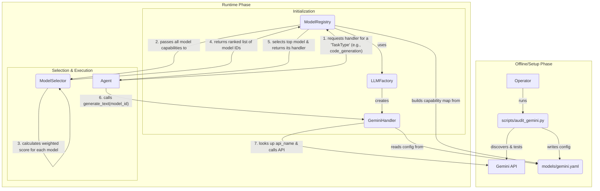

# Gemini API Integration and Control in MindX

This document provides a comprehensive overview of how the MindX system discovers, configures, selects, and controls its interactions with the Google Gemini API. The architecture is designed to be robust, resilient, and adaptable, allowing the system's capabilities to evolve without direct code modifications.

The process can be broken down into three main phases: **Configuration**, **Initialization**, and **Runtime Selection**.

---

## Ⅰ. Configuration: The `audit_gemini.py` Script

The foundation of MindX's Gemini integration is the `scripts/audit_gemini.py` utility. This is an offline tool run by an operator to establish a ground truth of available models and their capabilities. It acts as the bridge between the models offered by the Google API and the configuration the MindX system uses at runtime.

### Purpose and Workflow

The primary purpose of the script is to automate the tedious and error-prone process of keeping the system's model configuration up-to-date.

1.  **Discovery:** The script connects to the Google Gemini API using the `GEMINI_API_KEY` from the `.env` file and queries for a complete list of all models accessible to that key.
2.  **Capability Assessment:** For each discovered model, it performs a series of live tests to verify its actual, operational capabilities. This is crucial because a model may be listed by the API but not enabled for a specific function. The core capabilities tested are:
    -   **Text Generation:** Can the model respond to a simple text prompt?
    -   **Vision (Multimodal):** Can the model process an image as part of a prompt?
    -   **Embedding:** Can the model be used to generate text embeddings?
3.  **Configuration Generation:** Based on the results of the audit, the script's primary function (`--update-config`) is to generate or update the central `models/gemini.yaml` configuration file. It intelligently merges the new findings with any existing manual configurations (like `task_scores`), ensuring that human-provided data is preserved while technical data is refreshed.

### Command-Line Usage

The script is invoked from the project root:

-   **To run a full audit and generate a JSON report:**
    ```bash
    python3 scripts/audit_gemini.py --test-all
    ```
    This produces a timestamped `.json` file in `data/gemini/` with the detailed results of the audit.

-   **To update the live YAML configuration for MindX:**
    ```bash
    python3 scripts/audit_gemini.py --update-config
    ```
    This is the most common use case, as it directly updates `models/gemini.yaml` with the latest operational models and their verified capabilities.

### The `gemini.yaml` File

This file is the single source of truth for the runtime system regarding Gemini models. It is generated by the audit script and read by the runtime components.

```yaml
# models/gemini.yaml
gemini/gemini-1.5-flash-latest:
  # The actual API name to be used in the SDK call
  api_name: gemini-1.5-flash-latest
  # A list of capabilities verified by the audit script
  assessed_capabilities:
  - text
  - vision
  # Manually or default-assigned scores for ranking purposes
  task_scores:
    reasoning: 0.85
    code_generation: 0.88
    # ... other tasks
  # Cost and performance metrics
  cost_per_kilo_input_tokens: 0.00035
  cost_per_kilo_output_tokens: 0.0007
  max_context_length: 1000000
```

---

## Ⅱ. Initialization: The Runtime Setup

When the MindX application starts, a series of components work together to prepare the system for LLM interaction, using the configuration created by the audit script.

1.  **`LLMFactory` (`llm/llm_factory.py`):**
    -   This factory is the central point for creating LLM handler instances.
    -   When requested to create a `gemini` handler, it instantiates the `GeminiHandler` class.
    -   It handles the complex logic of resolving API keys from various configuration sources (`.env`, JSON configs, etc.).

2.  **`GeminiHandler` (`llm/gemini_handler.py`):**
    -   Upon initialization, the `GeminiHandler` immediately reads and parses the `models/gemini.yaml` file into an internal `model_catalog`.
    -   This handler is the component that makes the actual API calls to Google. When its `generate_text` method is called with a specific model ID, it uses its internal catalog to find the correct `api_name` for the SDK.

3.  **`ModelRegistry` (`llm/model_registry.py`):**
    -   This is a singleton service that orchestrates all LLM resources.
    -   During its own initialization, it scans the system configuration and uses the `LLMFactory` to create and cache a handler for every configured provider (like Gemini).
    -   Crucially, it also parses the `gemini.yaml` file to create a `ModelCapability` object for each model, loading its `task_scores`, cost, provider name, and other metadata into memory.

---

## Ⅲ. Runtime Selection: How MindX Chooses a Model

This is the process by which an agent, at the moment it needs to perform a task, chooses the best available Gemini model.

### Data Flow for LLM Selection



### Step-by-Step Explanation

1.  **Agent Request:** An agent (e.g., `BDIAgent`) determines it needs to perform a task, such as `code_generation`. It does not ask for a specific model; instead, it asks the `ModelRegistry` for a handler suitable for its purpose.

2.  **`ModelSelector` (`llm/model_selector.py`):**
    -   The `ModelRegistry` delegates the decision to the `ModelSelector`. It passes its entire list of `ModelCapability` objects (for all providers, not just Gemini) to the selector.
    -   The `ModelSelector` uses a **weighted scoring algorithm** to rank every single model for the requested task (`code_generation`).
    -   The score for each model is calculated based on several factors, with configurable weights:
        -   **`capability_match` (Weight: 3.0):** The model's specific score for `code_generation` as defined in `gemini.yaml`. This is the most heavily weighted factor.
        -   **`success_rate` (Weight: 2.0):** The model's historical success rate (a dynamic metric provided by the `PerformanceMonitor`).
        -   **`cost_factor` (Weight: 1.5):** A score that favors cheaper models.
        -   **`latency_factor` (Weight: 0.5):** A score that favors faster models.
        -   **`provider_preference` (Weight: 0.2):** A small bonus for certain providers.

3.  **Final Selection and Execution:**
    -   The `ModelSelector` returns a ranked list of the best model IDs (e.g., `['gemini/gemini-1.5-flash-latest', ...]`).
    -   The `ModelRegistry` takes the top model from this list.
    -   It identifies the model's provider (which is `gemini`) and retrieves the cached `GeminiHandler` instance.
    -   The agent receives this handler and calls `handler.generate_text(prompt, model='gemini/gemini-1.5-flash-latest')`.
    -   The `GeminiHandler` receives the request, looks up `gemini/gemini-1.5-flash-latest` in its internal catalog to get the `api_name` (`gemini-1.5-flash-latest`), and executes the final, specific API call to Google.

This decoupled, multi-layered architecture ensures that MindX's interaction with the Gemini API is both intelligent and maintainable. The system can dynamically adapt to new models, prioritize cost or performance, and maintain a clear separation between the static configuration of models and the dynamic logic of their selection and use.
