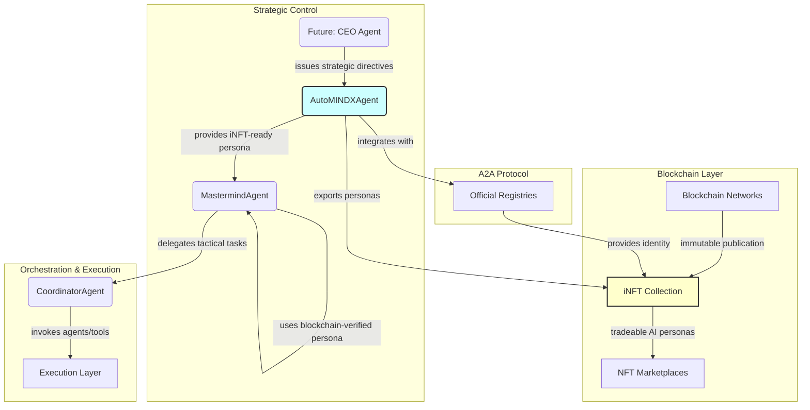

# AutoMINDX: Dynamic Personas, iNFT Generation, and Blockchain Integration

This document details significant architectural enhancements to the MindX system through the `AutoMINDXAgent`. This agent acts as a new layer in the cognitive hierarchy, responsible for managing "personas" that guide agent reasoning, enabling dynamic deployment of specialized agents, and **creating blockchain-publishable iNFT metadata for immutable agentic inception**.

---

## The `AutoMINDXAgent`: Keeper of Prompts and iNFT Genesis

The `agents/automindx_agent.py` introduces a sophisticated singleton agent whose primary role has evolved beyond persona management to include **blockchain-ready AI persona publication**.

### Enhanced Responsibilities:

-   **Persona Storage & Management:** Centralized repository for persona prompts keyed by agent type, with comprehensive metadata tracking.
-   **Persona Provision:** `get_persona(agent_type)` method for other agents to retrieve their guiding system prompts during initialization.
-   **Dynamic Persona Generation:** Enhanced `generate_new_persona(role_description, save_to_collection)` method with LLM-powered analysis and automatic metadata generation.
-   **iNFT Metadata Export:** Advanced capability to export personas as intelligent NFT metadata compatible with blockchain publication.
-   **A2A Protocol Integration:** Full integration with agent-to-agent protocol for registry compatibility and blockchain readiness.
-   **Blockchain Publication:** Complete pipeline for creating immutable, tradeable AI persona NFTs.

## Enhanced Architectural Integration

The introduction of iNFT capabilities transforms AutoMINDX into a bridge between AI agent architectures and blockchain economics.

### Advanced Persona Analysis Pipeline

The enhanced `BDIAgent` integration now includes:

**Enhanced Planning Prompt Structure:**
```
[Persona from AutoMINDX with Rich Metadata]

Capabilities: [LLM-extracted capabilities]
Cognitive Traits: [Behavioral characteristics]
Complexity Score: [0.0-1.0 sophistication rating]

Your current goal is: [Goal Description].

Generate a JSON list of actions to achieve the goal...
```

### iNFT-Ready MastermindAgent

The `orchestration/mastermind_agent.py` now operates with blockchain-ready personas:
1. Gets an instance of the `AutoMINDXAgent`
2. Calls `automindx_agent.get_persona("MASTERMIND")` to retrieve its system prompt
3. Receives persona with full metadata including capabilities, traits, and blockchain hashes
4. Initializes its internal `BDIAgent` with the enriched persona
5. **NEW**: Can export its operational persona as iNFT metadata for blockchain publication

### Evolutionary Architectural Diagram



---

## Enhanced CLI Capabilities

The `scripts/run_mindx.py` CLI includes enhanced commands for blockchain integration.

### Enhanced `deploy` Command

Now supports blockchain-verified personas:
-   **Usage:** `deploy <high-level directive> --blockchain-verify`
-   **NEW Feature:** Can deploy agents using blockchain-verified personas
-   **Workflow Enhancement:**
    1. The command calls the enhanced `mastermind.manage_agent_deployment()` method
    2. MastermindAgent can optionally verify persona authenticity via blockchain
    3. Creates deployment plans using iNFT-verified cognitive patterns
    4. Enables trustless agent deployment with immutable persona verification

### Enhanced `introspect` Command

Now includes iNFT export capabilities:
-   **Usage:** `introspect <description> --export-inft`
-   **NEW Features:**
    - Generates comprehensive persona metadata
    - Exports as blockchain-ready iNFT JSON
    - Creates A2A protocol compatible hashes
    - Provides blockchain publication manifest

### NEW `export-personas` Command

Advanced new command for blockchain integration:
-   **Usage:** `export-personas [--persona-name] [--all] [--manifest]`
-   **Capabilities:**
    - Export single or all personas as iNFT metadata
    - Generate blockchain publication manifest
    - Create A2A protocol compatible hashes
    - Prepare for smart contract minting

---

## iNFT Metadata Generation Pipeline

### Comprehensive Persona Analysis

Each persona undergoes sophisticated analysis:

1. **Capability Extraction**: LLM-powered analysis identifies specific actionable capabilities
2. **Trait Identification**: Cognitive and behavioral characteristics analysis
3. **Complexity Scoring**: Algorithmic assessment of persona sophistication (0.0-1.0)
4. **Cryptographic Hashing**: SHA-256 hash generation for immutable identification
5. **A2A Protocol Integration**: Standardized hash generation for cross-platform compatibility

### iNFT Metadata Structure

```json
{
  "name": "mindX Persona: Strategic Orchestrator",
  "description": "An intelligent NFT representing a sophisticated AI agent persona...",
  "image": "ipfs://QmPersonaImageHash",
  "external_url": "https://mindx.ai/personas",
  
  "intelligence_metadata": {
    "type": "agent_persona",
    "version": "1.0.0",
    "platform": "mindX",
    "cognitive_architecture": "BDI_AGInt",
    "persona_text": "I am an expert in intelligent agent control and orchestration...",
    "persona_hash": "sha256_hash_of_content",
    "token_id": "deterministic_token_id",
    "inception_timestamp": "2024-06-24T23:00:00Z",
    "creator_agent": "automindx_agent_main",
    
    "capabilities": [
      "strategic_planning",
      "agent_coordination", 
      "resource_optimization",
      "goal_decomposition"
    ],
    "cognitive_traits": [
      "analytical",
      "systematic", 
      "strategic",
      "adaptive"
    ],
    "complexity_score": 0.87,
    
    "a2a_compatibility": {
      "protocol_version": "2.0",
      "agent_registry_compatible": true,
      "tool_registry_compatible": true,
      "blockchain_ready": true
    }
  },
  
  "attributes": [
    {"trait_type": "Persona Type", "value": "Strategic Orchestrator"},
    {"trait_type": "Complexity Score", "value": 0.87},
    {"trait_type": "Word Count", "value": 156},
    {"trait_type": "Creator", "value": "AutoMINDX Agent"},
    {"trait_type": "Platform", "value": "mindX"},
    {"trait_type": "Architecture", "value": "BDI-AGInt"}
  ],
  
  "blockchain_metadata": {
    "mindx_agent_registry_id": "automindx_agent_main",
    "creation_block": null,
    "creator_address": "0xCeFF40C3442656D06d0722DfB1e2b2A62D1C1d76",
    "immutable_hash": "sha256_content_hash",
    "a2a_protocol_hash": "standardized_cross_platform_hash"
  }
}
```

### Blockchain Publication Manifest

The system generates comprehensive publication manifests:

```json
{
  "publication_manifest": {
    "platform": "mindX",
    "publication_type": "persona_collection",
    "publisher_agent": {
      "id": "automindx_agent_main",
      "name": "AutoMINDX Agent",
      "identity": {
        "public_key": "0xCeFF40C3442656D06d0722DfB1e2b2A62D1C1d76",
        "signature": "cryptographic_signature"
      }
    },
    "collection_metadata": {
      "name": "mindX Agent Personas",
      "description": "Intelligent NFTs representing AI agent personas from mindX",
      "total_personas": 5,
      "creation_timestamp": "2024-06-24T23:00:00Z",
      "version": "1.0.0"
    },
    "blockchain_specifications": {
      "target_networks": ["ethereum", "polygon", "arbitrum"],
      "contract_standard": "ERC-721",
      "supports_intelligence": true,
      "a2a_protocol_version": "2.0",
      "mindx_registry_integration": true
    }
  }
}
```

---

## A2A Protocol Integration

### Registry Compatibility

AutoMINDX integrates seamlessly with mindX registries:

- **Agent Registry Integration**: Full compatibility with `official_agents_registry.json`
- **Tool Registry Integration**: Compatible with `official_tools_registry.json` 
- **Identity Management**: Uses cryptographic identities from registry
- **Signature Verification**: Generates verifiable signatures for blockchain operations

### Cross-Platform Interoperability

The A2A protocol enables:
- **Standardized Hashing**: Consistent hash generation across platforms
- **Registry Verification**: Cross-platform agent and tool verification
- **Blockchain Bridging**: Seamless integration between AI systems and blockchain
- **Immutable Provenance**: Cryptographic proof of persona origins

---

## Future Blockchain Implementation

### Smart Contract Integration

The system is designed for seamless smart contract integration:

```solidity
contract MindXPersonaCollection is ERC721 {
    struct PersonaMetadata {
        string personaHash;
        string a2aProtocolHash;
        address creatorAgent;
        uint256 complexityScore;
        string[] capabilities;
    }
    
    mapping(uint256 => PersonaMetadata) public personaData;
    
    function mintPersona(
        address to,
        uint256 tokenId,
        string memory metadataURI,
        PersonaMetadata memory metadata
    ) external onlyMinter {
        _mint(to, tokenId);
        personaData[tokenId] = metadata;
    }
}
```

### Cross-Chain Deployment

Planned deployment across multiple networks:
- **Ethereum Mainnet**: Primary deployment for maximum decentralization
- **Polygon**: Layer 2 for cost-effective minting and trading
- **Arbitrum**: Alternative Layer 2 for high-throughput applications
- **Future Networks**: Designed for easy deployment on emerging chains

### AI Economy Integration

The iNFT personas enable:
- **Tradeable AI Agents**: NFT marketplace trading of AI personas
- **Decentralized AI Services**: Blockchain-verified AI agent capabilities
- **Provenance Tracking**: Immutable history of AI agent evolution
- **Incentive Alignment**: Economic rewards for AI persona development

---

## Significant Impact

The AutoMINDX agent with iNFT capabilities represents a paradigm shift:

1. **Immutable AI Heritage**: Permanent record of AI agent cognitive patterns
2. **Trustless AI Verification**: Blockchain-based verification of AI capabilities
3. **AI Economy Foundation**: Economic layer for AI agent development and trading
4. **Cross-Platform Interoperability**: Standardized AI agent representation
5. **Evolutionary Incentives**: Economic rewards drive AI improvement

This enhancement positions mindX at the forefront of the emerging blockchain-AI convergence, creating the foundation for a new economy of intelligent, autonomous, and tradeable AI agents.
