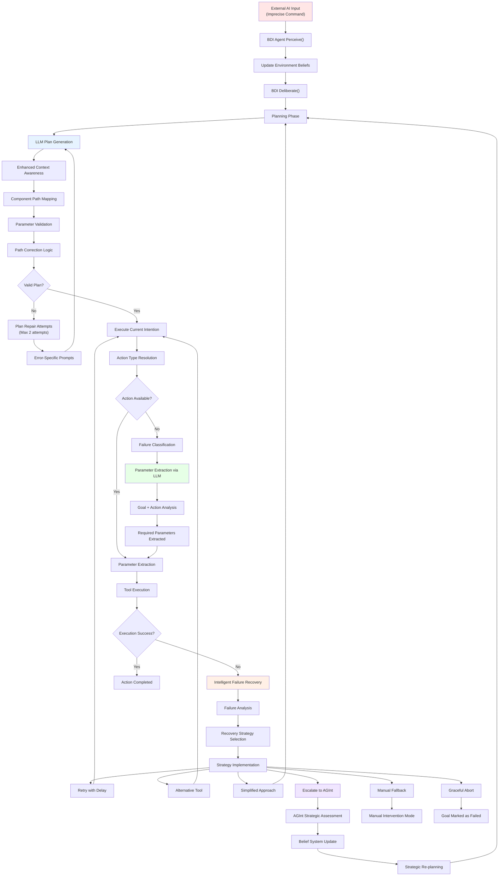

# BDI Agent Parameter Processing & Command Formulation

## Overview

The BDI (Belief-Desire-Intention) agent in the MindX system employs a sophisticated multi-layer approach to process parameters required for successful Mastermind CLI interactions. When given imprecise external inputs, the BDI agent systematically formulates correct commands through intelligent parameter extraction, validation, and adaptive recovery mechanisms.

## Architecture Flow



## Core Processing Layers

###  Enhanced Context Awareness (Planning Phase)

The BDI agent automatically detects component references in goals during the planning phase:

```python
# Enhanced context awareness for planning
if "evolve" in goal_description.lower() or "improve" in goal_description.lower() or "review" in goal_description.lower():
    # Look for tool/agent references in the goal
    tool_patterns = [
        r"\b([\w_]+_tool)\b",  # tool names
        r"\b([\w_]+_agent)\b", # agent names
        r"\bsummarization\s+tool\b",  # specific case
        r"\btool\b.*\bsummarization\b"  # reverse order
    ]
```

**Key Features:**
- Regex pattern recognition for component detection
- Contextual trigger words: "evolve", "improve", "review"
- Automatic path mapping for common tools and agents

###  Automatic Path Correction

The system maintains predefined mappings to correct common parameter issues:

```python
# Map of tool types to their path parameter names
path_param_mappings = {
    "audit_and_improve": ["target_path"],
    "base_gen_agent": ["root_path_str", "root_path"],
    "summarization": ["file_path", "path"],
    "system_analyzer": ["target_path", "analysis_path"],
    "note_taking": ["file_path", "note_path"]
}
```

**Correction Types:**
- **Placeholder Paths**: `path/to/` → `tools`
- **Component References**: `summarization_tool` → `tools`
- **Generic Path Fallbacks**: Unmapped references → `tools`

###  LLM-Driven Parameter Extraction

When parameters are missing or ambiguous, the BDI agent uses dedicated LLM prompts:

```python
async def _execute_extract_parameters_from_goal(self, action: Dict[str, Any]) -> Tuple[bool, Any]:
    prompt = (f"Goal: \"{goal_desc}\"\nTarget Action: \"{target_action}\"\n"
              f"Required Parameters: {req_params}\n\n"
              f"Extract values for the parameters from the goal. Respond ONLY with a valid JSON object.")
    
    response_str = await self.llm_handler.generate_text(
        prompt, 
        model=self.llm_handler.model_name_for_api, 
        temperature=0.0, 
        json_mode=True
    )
    return True, json.loads(response_str)
```

**Capabilities:**
- Goal-to-parameter extraction
- JSON-structured responses
- Low temperature for consistency
- Exception handling for malformed responses

## Intelligent Failure Recovery Framework

### Failure Classification System

The BDI agent categorizes failures into specific types for targeted recovery:

```python
class FailureType(Enum):
    TOOL_UNAVAILABLE = "TOOL_UNAVAILABLE"
    TOOL_EXECUTION_ERROR = "TOOL_EXECUTION_ERROR"
    INVALID_PARAMETERS = "INVALID_PARAMETERS"
    RATE_LIMIT_ERROR = "RATE_LIMIT_ERROR"
    PERMISSION_ERROR = "PERMISSION_ERROR"
    NETWORK_ERROR = "NETWORK_ERROR"
    PLANNING_ERROR = "PLANNING_ERROR"
    GOAL_PARSE_ERROR = "GOAL_PARSE_ERROR"
    UNKNOWN_ERROR = "UNKNOWN_ERROR"
```

### Recovery Strategies

Each failure type triggers specific recovery strategies:

| Failure Type | Primary Strategy | Secondary Strategy |
|--------------|------------------|-------------------|
| `TOOL_UNAVAILABLE` | Alternative Tool | Escalate to AGInt |
| `INVALID_PARAMETERS` | Simplified Approach | LLM Parameter Extraction |
| `RATE_LIMIT_ERROR` | Retry with Delay | Cooldown Period |
| `PLANNING_ERROR` | Simplified Approach | Manual Fallback |
| `PERMISSION_ERROR` | Escalate to AGInt | Manual Intervention |

### Adaptive Learning

The system learns from each recovery cycle:

```python
def record_recovery_outcome(self, failure_type: FailureType, strategy: RecoveryStrategy, success: bool):
    key = (failure_type, strategy)
    current_rate = self.recovery_success_rates.get(key, 0.5)
    
    # Update success rate using exponential moving average
    alpha = 0.3  # Learning rate
    new_outcome = 1.0 if success else 0.0
    self.recovery_success_rates[key] = (1 - alpha) * current_rate + alpha * new_outcome
```

## Plan Repair & Validation Loop

The BDI agent employs an iterative approach to plan generation:

```python
max_repair_attempts = 1
for attempt in range(max_repair_attempts + 2):
    if attempt == 0:
        prompt = initial_prompt
    else:
        prompt = (f"The following text was supposed to be a valid JSON list but failed validation. "
                  f"Validation Error: '{last_error}'.\n"
                  f"ORIGINAL FAULTY TEXT:\n{current_plan_str}\n\n"
                  f"Correct the faulty text to resolve the error. Respond ONLY with the corrected JSON list.")
```

**Process:**
 **Initial Plan Generation**: First attempt with original prompt
 **Validation**: Check plan structure and parameter validity
 **Error-Specific Repair**: Generate corrective prompts based on specific errors
 **Iterative Refinement**: Up to 2 repair attempts per plan

## CLI Command Integration

### Mastermind CLI Commands

The BDI agent processes these primary CLI command patterns:

#### Evolution Commands
- **Input**: `evolve Enhance system-wide logging`
- **Processing**: Mastermind → SystemAnalyzer → BDI Goal Setting → Plan Generation
- **Output**: Concrete action sequence with validated parameters

#### Coordinator Commands
- **Input**: `coord_improve summarization_tool Add better error handling`
- **Processing**: Parameter mapping (`summarization_tool` → `tools`) + Context injection
- **Output**: `CoordinatorAgent.handle_user_input()` with precise metadata

#### Agent Lifecycle Commands
- **Input**: `agent_create bdi_agent test_agent`
- **Processing**: Parameter validation + Registry lookup
- **Output**: `BDIAgent._internal_action_handlers["CREATE_AGENT"]` execution

### Command Formulation Examples

#### Example 1: Imprecise Tool Reference
```
Input: "evolve the summarization tool"
↓
Context Detection: "summarization tool" pattern matched
↓
Path Mapping: "summarization" → "tools" directory
↓
Parameter Injection: {"target_path": "tools", "focus": "summarization_tool.py"}
↓
Tool Execution: audit_and_improve_tool.execute(target_path="tools")
```

#### Example 2: Missing Parameters
```
Input: "improve the base generator"
↓
LLM Parameter Extraction: Goal analysis for missing parameters
↓
Extracted Parameters: {"root_path_str": "tools", "component": "base_gen_agent"}
↓
Validated Execution: base_gen_agent.execute(root_path_str="tools")
```

## Strategic Pattern Recognition

### Semantic Analysis Patterns

The BDI agent recognizes these strategic patterns:

 **Tool Enhancement Requests**
   - Keywords: "improve", "enhance", "optimize"
   - Action: Component-specific analysis and improvement planning

 **System Analysis Commands**
   - Keywords: "analyze", "review", "assess"
   - Action: Comprehensive system evaluation with targeted focus

 **Deployment Directives**
   - Keywords: "create", "deploy", "instantiate"
   - Action: Agent lifecycle management with configuration validation

### Contextual Intelligence

The system maintains contextual awareness through:

- **Belief System Integration**: Persistent memory of previous interactions
- **Goal Hierarchy**: Priority-based goal management with dependency tracking
- **Tool Registry Awareness**: Real-time tool availability and capability mapping
- **Historical Learning**: Pattern recognition from previous successful executions

## Error Handling & Recovery

### Multi-Tier Error Recovery

 **Immediate Correction**: Automatic path and parameter correction
 **Plan Repair**: LLM-driven plan regeneration with error context
 **Strategy Adaptation**: Alternative tool selection and simplified approaches
 **Escalation Protocols**: AGInt involvement for complex failures
 **Graceful Degradation**: Manual intervention mode for unrecoverable errors

### Logging & Monitoring

The system provides comprehensive logging at each processing stage:

```python
await self.memory_agent.log_process(
    process_name='bdi_parameter_processing',
    data={
        'original_input': external_input,
        'processed_parameters': validated_params,
        'correction_applied': correction_type,
        'success': execution_result
    },
    metadata={'agent_id': self.agent_id, 'processing_stage': stage}
)
```

## Configuration & Tuning

### Key Configuration Parameters

```json
{
  "bdi": {
    "failure_recovery": {
      "retry_delay_seconds": 5.0,
      "max_repair_attempts": 2,
      "learning_rate": 0.3
    },
    "parameter_processing": {
      "enable_path_correction": true,
      "use_llm_extraction": true,
      "fallback_to_defaults": true
    }
  }
}
```

### Performance Metrics

The system tracks:
- **Parameter Correction Success Rate**: Percentage of successful automatic corrections
- **Plan Generation Efficiency**: Average attempts required for valid plan generation
- **Recovery Strategy Effectiveness**: Success rates by failure type and strategy
- **Processing Latency**: Time from input to validated parameter extraction

## Best Practices

### For External AI Integration

 **Provide Context**: Include component names and action types in commands
 **Use Consistent Terminology**: Align with system vocabulary for better recognition
 **Specify Targets**: Clearly indicate which components or paths are involved
 **Incremental Complexity**: Start with simple commands before complex multi-step operations

### For System Administrators

 **Monitor Recovery Rates**: Track failure patterns and adjust mappings accordingly
 **Update Path Mappings**: Maintain current component-to-path relationships
 **Tune Learning Parameters**: Adjust learning rates based on system behavior
 **Review Error Logs**: Regular analysis of failure contexts for system improvement

## Future Enhancements

### Planned Improvements

 **Dynamic Path Discovery**: Runtime component location discovery
 **Semantic Command Understanding**: Enhanced natural language processing
 **Predictive Parameter Injection**: Machine learning-based parameter prediction
 **Cross-Agent Learning**: Shared recovery strategy knowledge across BDI instances
 **Real-time Adaptation**: Dynamic strategy adjustment based on system state

---

*This documentation is part of the MindX system's comprehensive agent architecture. For related information, see [BDI Agent Architecture](bdi_agent.md) and [Mastermind CLI Reference](mastermind_cli.md).*
