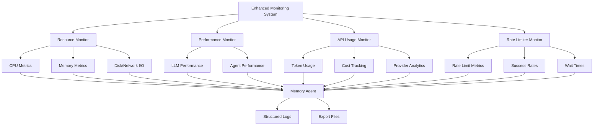

# Enhanced Monitoring System

## Overview

The Enhanced Monitoring System provides comprehensive, real-time monitoring of system resources, API usage, performance metrics, and rate limiting across the mindX framework. It integrates seamlessly with the MemoryAgent for persistent storage and structured alerting.

## Architecture



## Core Components

### 1. Token Calculator Tool (Production Cost Management)

The **TokenCalculatorTool** serves as the cornerstone of the monitoring system's cost management capabilities, providing production-grade token cost calculation, usage tracking, and budget optimization for all LLM operations.

#### Key Features:
- **High-precision Decimal arithmetic** for financial calculations (6 decimal places)
- **Multi-provider support** (Google, OpenAI, Anthropic, Groq, Mistral)
- **Real-time budget monitoring** with configurable alerting (75% threshold default)
- **Advanced caching and rate limiting** (300 calls/minute default)
- **Thread-safe operations** with comprehensive error handling
- **Production-grade metrics collection** with circuit breaker pattern

#### Core Operations:
```python
# Cost estimation with high precision
result = await token_calculator.execute(
    "estimate_cost",
    text="Analyze this code snippet",
    model="gemini-1.5-flash",
    operation_type="code_generation"
)

# Usage tracking with budget monitoring
result = await token_calculator.execute(
    "track_usage",
    agent_id="analyzer_agent",
    operation="code_analysis",
    model="gemini-1.5-flash",
    input_tokens=150,
    output_tokens=75,
    cost_usd=0.000375
)

# Comprehensive system metrics
result = await token_calculator.execute("get_metrics")
```

#### Integration with Monitoring System:
The TokenCalculatorTool integrates seamlessly with the Enhanced Monitoring System to provide:
- **Automated cost tracking** for all agent LLM operations
- **Budget alert integration** with the alerting system
- **Comprehensive usage reports** for performance analysis
- **Cost optimization recommendations** based on usage patterns

### 2. Enhanced Resource Monitoring

#### Detailed CPU Metrics:
- **Per-core usage**: Individual CPU core utilization percentages
- **CPU frequency**: Current, minimum, and maximum CPU frequencies
- **CPU counts**: Logical and physical core counts
- **Load averages**: 1, 5, and 15-minute system load averages
- **Total CPU utilization**: Overall system CPU usage percentage

#### Comprehensive Memory Metrics:
- **Physical RAM**: Total, used, available, free memory in GB
- **Memory percentages**: Current memory utilization percentage
- **Cache and buffers**: Cached and buffered memory allocation
- **Swap memory**: Total, used, free swap space in GB and percentages
- **Memory efficiency**: Available vs. allocated memory ratios

#### System Metrics:
- **Disk usage**: Per-mountpoint disk utilization
- **Network I/O**: Bytes and packets sent/received
- **Process count**: Total number of active processes

### 3. API Token Usage Monitoring

#### Comprehensive Token Tracking:
- **Token counts**: Prompt and completion tokens per API call
- **Cost tracking**: Real-time cost accumulation per model/provider
- **Efficiency metrics**: Completion/prompt token ratios
- **Provider analytics**: Usage breakdown by API provider
- **Hourly usage patterns**: Time-based usage analytics
- **Rate limiting impact**: Tracking of rate limit hits

#### Cost Analysis:
- **Per-call costs**: Individual API call cost tracking
- **Cumulative costs**: Running totals per model and provider
- **Budget monitoring**: Daily/monthly cost threshold alerts
- **Cost efficiency**: Cost per token and per successful call

#### Provider Intelligence:
- **Multi-provider support**: OpenAI, Anthropic, Google, Groq tracking
- **Model comparison**: Performance and cost analysis across models
- **Usage optimization**: Recommendations based on efficiency metrics

### 4. Rate Limiter Performance Monitoring

#### Advanced Rate Limiting Metrics:
- **Success rates**: Percentage of successful API calls
- **Block rates**: Frequency of rate limit blocks
- **Wait times**: Average, P50, P90, P99 wait time percentiles
- **Token utilization**: Current token bucket fill levels
- **Retry patterns**: Statistics on retry attempts and backoff

#### Performance Analysis:
- **Health status**: Healthy, degraded, or critical status assessment
- **Request patterns**: Temporal analysis of API request patterns
- **Efficiency tracking**: Rate limiter effectiveness metrics
- **Alert thresholds**: Configurable alerts for performance degradation

### 5. Intelligent Alerting System

#### Multi-level Alert Severity:
- **CRITICAL**: System-threatening conditions requiring immediate attention
- **HIGH**: Performance degradation requiring prompt action
- **MEDIUM**: Notable conditions that should be monitored
- **LOW**: Minor issues or informational alerts
- **INFO**: General system state information

#### Resource Alerts:
- **CPU thresholds**: Configurable warning (70%) and critical (90%) levels
- **Memory alerts**: RAM usage warnings (70%) and critical (85%) thresholds
- **Swap monitoring**: Swap usage alerts (60% warning, 80% critical)
- **Disk space**: Per-mountpoint disk usage alerts (80% warning, 90% critical)

#### API Usage Alerts:
- **Cost thresholds**: Daily/monthly spending limit alerts
- **Rate limiting**: Frequent rate limit hit notifications
- **Efficiency warnings**: Low token efficiency ratio alerts
- **Provider issues**: API provider-specific performance alerts

#### Rate Limiter Alerts:
- **Success rate degradation**: Alerts when success rate drops below 70%
- **High blocking rates**: Notifications when blocking exceeds 50%
- **Extended wait times**: Alerts for wait times exceeding 5 seconds

## API Reference

### Core Monitoring Methods

#### Enhanced Resource Collection
```python
# Automatic detailed resource collection every 30 seconds (configurable)
await monitoring_system.start_monitoring()

# Get current comprehensive metrics
metrics = monitoring_system.get_current_metrics()
print(f"CPU: {metrics['resource_metrics']['cpu_percent']}%")
print(f"Memory: {metrics['resource_metrics']['memory_used_gb']:.1f}GB")
print(f"Swap: {metrics['resource_metrics']['swap_percent']}%")
```

#### API Token Usage Tracking
```python
# Log comprehensive API token usage
await monitoring_system.log_api_token_usage(
    model_name="gpt-4",
    provider="openai",
    prompt_tokens=150,
    completion_tokens=200,
    cost_usd=0.005,
    success=True,
    rate_limited=False,
    metadata={"agent_id": "my_agent", "task": "code_generation"}
)

# Get API usage summary
api_summary = await monitoring_system.get_api_usage_summary(hours_back=24)
print(f"Total Cost: ${api_summary['summary']['total_cost_usd']:.3f}")
print(f"Total Tokens: {api_summary['summary']['total_tokens']:,}")
```

#### Rate Limiter Integration
```python
# Enhanced rate limiter with monitoring
def monitoring_callback(metrics):
    asyncio.create_task(monitoring_system.log_rate_limiter_metrics(
        provider="openai",
        model_name="gpt-4", 
        rate_limiter_metrics=metrics
    ))

rate_limiter = RateLimiter(
    requests_per_minute=60,
    max_retries=3,
    monitoring_callback=monitoring_callback
)

# Get rate limiter health summary
limiter_summary = await monitoring_system.get_rate_limiter_summary()
print(f"Overall Health: {limiter_summary['overall_health']}")
```

### Performance Monitoring

#### LLM Performance Tracking
```python
# Enhanced LLM performance logging
await monitoring_system.log_llm_performance(
    model_name="gpt-4",
    task_type="code_generation",
    agent_id="enhanced_simple_coder",
    latency_ms=2500,
    success=True,
    prompt_tokens=200,
    completion_tokens=150,
    cost=0.008,
    error_type=None,
    metadata={"complexity": "high", "language": "python"}
)
```

#### Agent Performance Tracking
```python
# Agent execution performance
await monitoring_system.log_agent_performance(
    agent_id="bdi_agent",
    action_type="planning",
    execution_time_ms=1200,
    success=True,
    metadata={"goal_complexity": "medium"}
)
```

## Configuration Options

### Monitoring Intervals
```json
{
  "monitoring": {
    "interval_seconds": 30.0,
    "alert_cooldown_seconds": 300,
    "memory_logging_enabled": true,
    "log_performance_details": true
  }
}
```

### Resource Thresholds
```json
{
  "monitoring": {
    "thresholds": {
      "cpu_critical": 90.0,
      "cpu_warning": 70.0,
      "memory_critical": 85.0,
      "memory_warning": 70.0,
      "disk_critical": 90.0,
      "disk_warning": 80.0,
      "swap_critical": 80.0,
      "swap_warning": 60.0
    }
  }
}
```

### API Usage Thresholds
```json
{
  "monitoring": {
    "api": {
      "daily_cost_threshold": 100.0,
      "rate_limit_threshold": 10,
      "efficiency_threshold": 0.1
    }
  }
}
```

### Rate Limiter Configuration
```json
{
  "rate_limit_profiles": {
    "default_rpm": 2,
    "agint_rpm": 5,
    "bdi_rpm": 15,
    "high_volume_rpm": 60
  }
}
```

## Data Storage and Persistence

### Memory Agent Integration
- **Structured logging**: All metrics stored as timestamped memory records
- **Automatic organization**: Date-based directory structure (YYYYMMDD)
- **Memory types**: SYSTEM_STATE, PERFORMANCE, ERROR categorization
- **Importance levels**: CRITICAL, HIGH, MEDIUM, LOW priority classification

### Export Functionality
```python
# Export comprehensive metrics to JSON
export_path = await monitoring_system.export_metrics_to_file()
print(f"Metrics exported to: {export_path}")

# Generate detailed monitoring report
report = await monitoring_system.generate_monitoring_report(hours_back=24)
```

### Storage Structure
```
data/
├── monitoring/
│   └── logs/
│       └── metrics_export_YYYYMMDD_HHMMSS.json
└── memory/
    └── stm/
        └── enhanced_monitoring_system/
            └── YYYYMMDD/
                ├── YYYY-MM-DDTHH-MM-SS.system_state.memory.json
                ├── YYYY-MM-DDTHH-MM-SS.performance.memory.json
                └── YYYY-MM-DDTHH-MM-SS.api_usage.memory.json
```

## Integration Examples

### LLM Handler Integration
```python
# In LLM handlers, integrate token usage tracking
class GeminiHandler(LLMHandlerInterface):
    async def generate_text(self, prompt, model, **kwargs):
        start_time = time.time()
        
        try:
            response = await self._api_call(prompt, model, **kwargs)
            
            # Log successful API usage
            await monitoring_system.log_api_token_usage(
                model_name=model,
                provider="gemini",
                prompt_tokens=response.usage.prompt_tokens,
                completion_tokens=response.usage.completion_tokens,
                cost_usd=self._calculate_cost(response.usage),
                success=True,
                rate_limited=False
            )
            
            return response.text
            
        except RateLimitError as e:
            # Log rate limited API usage
            await monitoring_system.log_api_token_usage(
                model_name=model,
                provider="gemini",
                prompt_tokens=0,
                completion_tokens=0,
                cost_usd=0.0,
                success=False,
                rate_limited=True
            )
            raise
```

### Agent Integration
```python
# In BDI agents, track performance metrics
class BDIAgent:
    async def execute_action(self, action):
        start_time = time.time()
        
        try:
            result = await self._perform_action(action)
            execution_time = (time.time() - start_time) * 1000
            
            await monitoring_system.log_agent_performance(
                agent_id=self.agent_id,
                action_type=action.type,
                execution_time_ms=execution_time,
                success=True,
                metadata={"action_complexity": action.complexity}
            )
            
            return result
            
        except Exception as e:
            execution_time = (time.time() - start_time) * 1000
            
            await monitoring_system.log_agent_performance(
                agent_id=self.agent_id,
                action_type=action.type,
                execution_time_ms=execution_time,
                success=False,
                metadata={"error_type": type(e).__name__}
            )
            raise
```

## Monitoring Dashboards and Analysis

### Real-time Metrics Dashboard
```python
# Get real-time system overview
async def get_system_overview():
    current = monitoring_system.get_current_metrics()
    api_summary = await monitoring_system.get_api_usage_summary()
    limiter_summary = await monitoring_system.get_rate_limiter_summary()
    
    return {
        "system_health": {
            "cpu_usage": f"{current['resource_metrics']['cpu_percent']:.1f}%",
            "memory_usage": f"{current['resource_metrics']['memory_percent']:.1f}%",
            "swap_usage": f"{current['resource_metrics']['swap_percent']:.1f}%",
        },
        "api_usage": {
            "total_cost": f"${api_summary['summary']['total_cost_usd']:.3f}",
            "total_calls": api_summary['summary']['total_calls'],
            "avg_cost_per_call": f"${api_summary['summary']['avg_cost_per_call']:.4f}"
        },
        "rate_limiters": {
            "total_tracked": limiter_summary['total_limiters'],
            "overall_health": limiter_summary['overall_health']
        }
    }
```

### Cost Analysis
```python
# Analyze API costs and efficiency
async def analyze_api_efficiency():
    api_summary = await monitoring_system.get_api_usage_summary()
    
    efficiency_report = {}
    for model_key, model_data in api_summary['by_model'].items():
        efficiency_report[model_key] = {
            "cost_per_token": model_data['total_cost'] / max(model_data['total_tokens'], 1),
            "efficiency_ratio": model_data['efficiency'],
            "rate_limit_impact": model_data['rate_limit_hits'] / max(model_data['calls'], 1)
        }
    
    return efficiency_report
```

## Best Practices

### 1. Resource Monitoring
- **Monitor swap usage**: High swap indicates memory pressure
- **Track per-core CPU**: Identify single-threaded bottlenecks
- **Set appropriate thresholds**: Based on system capacity and workload

### 2. API Usage Optimization
- **Monitor token efficiency**: Optimize prompts for better completion/prompt ratios
- **Track costs regularly**: Set up daily/weekly cost threshold alerts
- **Analyze provider performance**: Compare latency and success rates across providers

### 3. Rate Limiter Tuning
- **Adjust rates based on provider limits**: Different providers have different rate limits
- **Monitor success rates**: Low success rates indicate over-aggressive rate limiting
- **Use appropriate retry strategies**: Balance between responsiveness and API courtesy

### 4. Alert Configuration
- **Set meaningful thresholds**: Based on historical data and system requirements
- **Implement alert cooldowns**: Prevent alert spam during extended issues
- **Prioritize alert severity**: Focus on critical alerts first

## Troubleshooting

### Common Issues

#### High Memory Usage
- Check swap usage percentage
- Monitor memory-intensive agents
- Review memory leak indicators in agent performance

#### API Cost Overruns
- Analyze token efficiency ratios
- Review high-cost model usage patterns
- Check for unnecessary API calls or retries

#### Rate Limiter Issues
- Monitor success rates and wait times
- Adjust rate limits based on provider capacity
- Check for excessive retry patterns

### Diagnostic Commands
```python
# Check overall system health
overview = await get_system_overview()
print(json.dumps(overview, indent=2))

# Analyze API efficiency
efficiency = await analyze_api_efficiency()
for model, metrics in efficiency.items():
    print(f"{model}: {metrics['cost_per_token']:.6f}$/token, {metrics['efficiency_ratio']:.3f} efficiency")

# Export detailed metrics for analysis
export_path = await monitoring_system.export_metrics_to_file()
print(f"Detailed metrics exported to: {export_path}")
```

## Conclusion

The Enhanced Monitoring System provides comprehensive, production-ready monitoring of all aspects of the mindX framework. With detailed resource tracking, API usage monitoring, rate limiter performance analysis, and intelligent alerting, it enables proactive system management and optimization.

Key benefits:
- **Real-time visibility** into system performance and resource usage
- **Cost control** through detailed API usage and cost tracking
- **Performance optimization** via comprehensive metrics and analysis
- **Proactive alerting** to prevent issues before they impact operations
- **Historical analysis** for capacity planning and trend identification