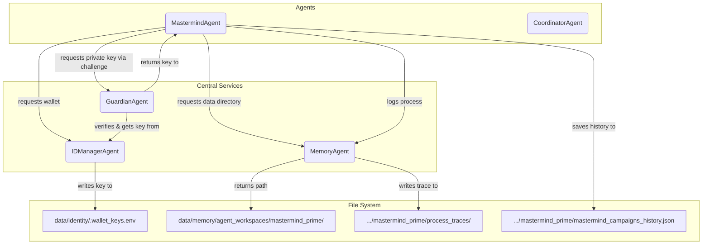

# MindX Memory, Logging, and Identity Sanity

This document outlines the corrected and simplified architecture for data persistence, logging, and identity management in the MindX system. The goal of this architecture is to be simple, robust, and easy to audit, with a clear separation of concerns.

---

## 1. Separation of Concerns

The system's architecture is now clarified to enforce a strict separation of concerns between managing identities, brokering access to secrets, and managing on-disk storage.

-   **`IDManagerAgent` (The Ledger):** This agent's **only** responsibility is to manage the central cryptographic key file. It creates keys and stores them. It does not create directories or broker access.

-   **`GuardianAgent` (The Broker):** This agent's **only** responsibility is to act as the secure gatekeeper for accessing private keys. No agent can get a private key without going through the `GuardianAgent`'s challenge-response protocol.

-   **`MemoryAgent` (The Librarian):** This agent is responsible for **all** other on-disk data storage. This includes creating workspaces for agents and storing all structured logs.

---

## 2. Identity and Security Workflow

### `IDManagerAgent` - The Ledger

-   **Single Source of Truth:** All private keys are stored in a **single, central file**: `data/identity/.wallet_keys.env`.
-   **Deterministic Creation:** The `create_new_wallet` method is now deterministic. It will only create a key for an `entity_id` if one does not already exist, preventing key duplication on restart.
-   **Belief System Integration:** To provide a fast, two-way lookup between an `entity_id` and its `public_address`, the `IDManagerAgent` records this mapping in the shared `BeliefSystem` upon key creation.

### `GuardianAgent` - The Broker

-   **Role:** Acts as the gatekeeper for all access to sensitive private keys.
-   **Challenge-Response:** Implements a challenge-response protocol to verify the identity of any agent requesting a private key.
-   **Key Release:** Only if the signature is verified does the `GuardianAgent` call the privileged `id_manager.get_private_key_for_guardian()` method to retrieve and return the private key.

---

## 3. Data Storage: Agent Workspaces and Logs

The `agents.memory_agent.MemoryAgent` manages all file-based data persistence.

### Agent Workspaces

-   **Location:** `data/memory/agent_workspaces/`
-   **Purpose:** This is the primary location for any persistent data an agent or tool needs to store. Each agent gets its own subdirectory named after its `agent_id`.
-   **Examples:**
    -   `.../agent_workspaces/automindx_agent_main/personas.json`: Stores the personas managed by the `AutoMINDXAgent`.
    -   `.../agent_workspaces/mastermind_prime/mastermind_campaigns_history.json`: Stores the history of campaigns run by the `MastermindAgent`.

### Process Traces (Logs)

-   **Location:** All structured logs generated by `memory_agent.log_process()` are now stored inside the workspace of the agent that generated the log, under a `process_traces` subdirectory.
-   **Example:** A log from the `MastermindAgent` will be saved to `data/memory/agent_workspaces/mastermind_prime/process_traces/`.
-   **Benefit:** This co-locates an agent's actions with its other data, making it much easier to audit and for other agents (like the `BlueprintAgent`) to analyze a specific agent's behavior.

### Diagram of Corrected Data Flow

This streamlined architecture provides a clear and sane model for how the MindX system handles its most critical data.
