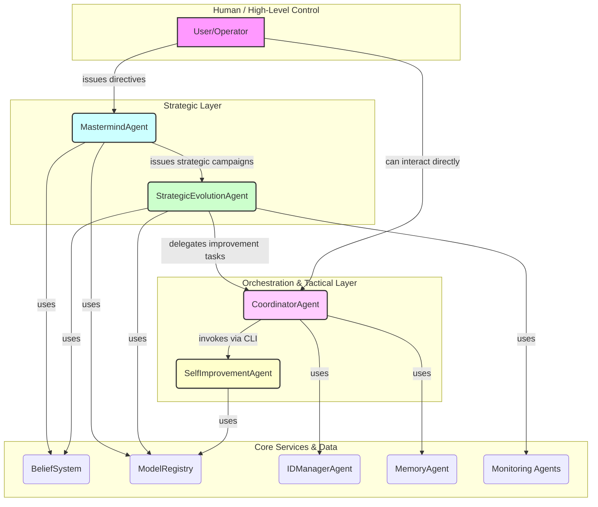
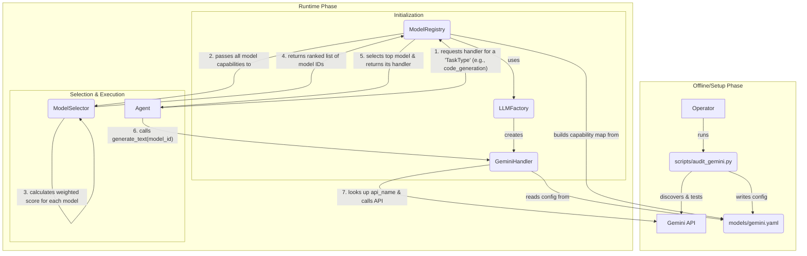
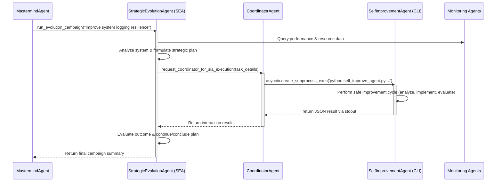

# MindX System Workflow and Architecture

This document provides a comprehensive overview of the MindX system's architecture, detailing the interaction between its core components and the flow of data and control during its primary operational workflows.

## Ⅰ. High-Level Architecture: The Agent Hierarchy

MindX operates on a hierarchical model of specialized agents, each with a distinct role. This separation of concerns ensures that strategic, tactical, and operational tasks are handled by the appropriate component.

-   **`MastermindAgent`**: The apex strategist. It formulates long-term goals and initiates broad "improvement campaigns."
-   **`StrategicEvolutionAgent` (SEA)**: The campaign manager. It analyzes the system to break down a broad campaign goal into a concrete, safe, multi-step plan.
-   **`CoordinatorAgent`**: The system conductor and service bus. It manages infrastructure, handles agent lifecycle, and provides operational foundation for the MastermindAgent's orchestration.
-   **`SelfImprovementAgent` (SIA)**: The "code surgeon." A CLI tool that performs the dangerous work of modifying and evaluating code.
-   **Core Services**: A suite of agents and modules providing foundational capabilities like memory, identity, knowledge representation, and LLM access.

---

## Ⅱ. The LLM Selection & Control Workflow

A core feature of MindX is its ability to dynamically select the best Large Language Model (LLM) for a given task. This workflow ensures a balance of performance, cost, and capability.

### Data Flow for LLM Selection

### Step-by-Step Explanation

1.  **Configuration (Offline):** An operator runs `scripts/audit_gemini.py`. This tool queries the Gemini API, discovers all available models, tests their functions (text, vision, etc.), and writes a detailed configuration file, `models/gemini.yaml`. This file includes the model's API name, its tested capabilities, and default scores for various tasks (e.g., `reasoning: 0.85`, `code_generation: 0.88`).

2.  **Initialization (Runtime):** When MindX starts, the `ModelRegistry` is initialized. It uses the `LLMFactory` to create a `GeminiHandler` (and handlers for any other configured providers). The `GeminiHandler` reads `models/gemini.yaml` to know which models exist. The `ModelRegistry` also reads this file to build a map of `ModelCapability` objects, which store the task scores, cost, and other metadata for each model.

3.  **Selection (Runtime):**
    -   An agent needs to perform a task, like `code_generation`. It asks the `ModelRegistry` for a suitable handler.
    -   The `ModelRegistry` passes its entire list of model capabilities to the `ModelSelector`.
    -   The `ModelSelector` calculates a weighted score for every model based on its suitability for `code_generation`, its historical success rate, cost, and latency.
    -   It returns a ranked list of the best models.

4.  **Execution (Runtime):**
    -   The `ModelRegistry` takes the top-ranked model, identifies its provider (`gemini`), and returns the cached `GeminiHandler`.
    -   The agent uses this handler to call `generate_text`, passing the specific ID of the top-ranked model.
    -   The `GeminiHandler` uses its internal catalog (from `gemini.yaml`) to find the correct API name for the model and makes the final call to the Google Gemini API.

---

## Ⅲ. The Strategic Improvement Workflow

This is the primary end-to-end workflow for making significant, planned improvements to the system. It involves the entire agent hierarchy.

### Control Flow for a Strategic Campaign

### Step-by-Step Explanation

1.  **Goal Initiation:** The `MastermindAgent` initiates the process by giving a high-level goal to the `StrategicEvolutionAgent` (SEA), such as "Improve system logging resilience."

2.  **Analysis and Planning (SEA):**
    -   The SEA uses its `SystemAnalyzerTool` to gather data. This tool queries the `PerformanceMonitor` for LLM error rates and the `ResourceMonitor` for system load.
    -   Based on this analysis, the SEA identifies a concrete target for improvement (e.g., "The `logging_config.py` file lacks robust error handling for file permissions").
    -   It then uses an LLM to generate a safe, multi-step plan. A critical rule is enforced: any plan to modify code **must** include steps for creating a rollback plan before the modification and running validation tests after.

3.  **Task Delegation (SEA to Coordinator):** The SEA delegates the tactical execution of its plan to the `CoordinatorAgent`. For a code change, it sends an interaction of type `COMPONENT_IMPROVEMENT` with the target file path and the specific improvement goal.

4.  **Execution (Coordinator to SIA):**
    -   The `CoordinatorAgent` receives the request. It uses its `heavy_task_semaphore` to ensure it doesn't overload the system with too many concurrent modifications.
    -   It invokes the `SelfImprovementAgent` (SIA) as a separate process via its command-line interface, passing the target file and goal as arguments. This decoupling is a key safety feature.

5.  **Code Modification (SIA):**
    -   The SIA performs its robust improvement cycle: it analyzes the code, generates a modification using an LLM, and then evaluates the change for syntax errors, adherence to the goal (via LLM critique), and, if modifying itself, by running a self-test suite.
    -   The SIA returns a structured JSON object to stdout indicating the success or failure of the operation.

6.  **Completion and Reporting:**
    -   The `CoordinatorAgent` captures the result from the SIA and marks its interaction as complete.
    -   The SEA receives the result from the Coordinator, evaluates the outcome, and proceeds with the next step in its strategic plan (e.g., running validation or triggering a rollback).
    -   Once its entire campaign plan is complete, the SEA reports the final summary back to the `MastermindAgent`.
